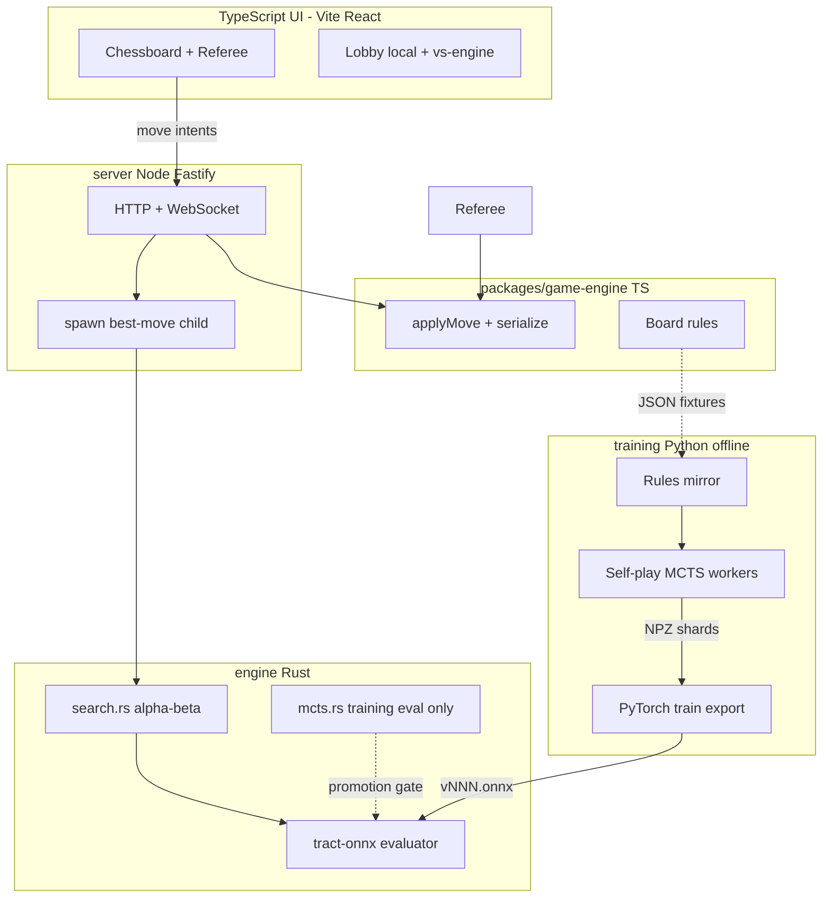
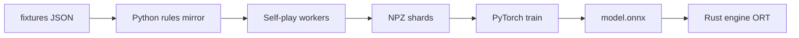
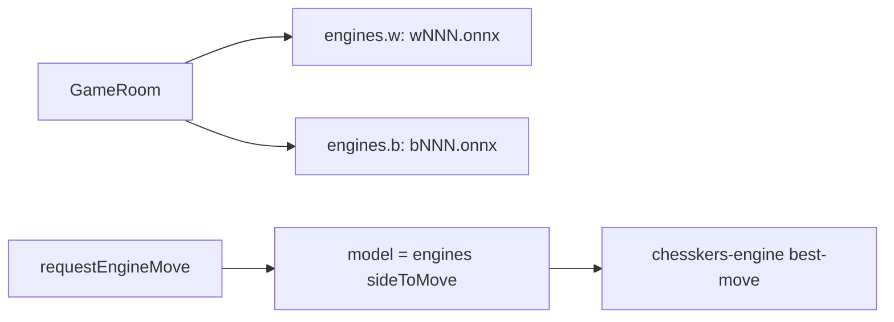

# Chesskers — Architecture Ground Truth

**Read this file first.** This document is the canonical reference for the Chesskers project. Future agents should pick a single milestone ID from [Section 7](#7-agent-milestone-checklist) (v1 complete; **v2** milestones prefixed `V2-`), verify prerequisites, implement only that scope, and check off the milestone when merged.

**Related docs:**

- [railway-vercel-migration.md](./railway-vercel-migration.md) — multiplayer wire protocol, server move pipeline, deployment detail
- [todo.md](./todo.md) — UI polish backlog (undo, redo, introduction)

---

## 1. Project overview

### What is Chesskers?

Chesskers is a chess/checkers hybrid played on an 8×8 board. White fields a standard chess army; black fields two checkers pieces with torus-wrapping movement. Win conditions are asymmetric — not standard chess checkmate.

### Project goal

Build a **separated architecture**:

| Component                  | Role                                                                                  |
| -------------------------- | ------------------------------------------------------------------------------------- |
| **React UI**               | Board rendering, input, sound, modals — no authoritative rules in online/engine modes |
| **TypeScript game-engine** | Canonical rules, serialization, shared `applyMove`                                    |
| **Rust engine**            | Alpha-beta search at play time + ONNX evaluation; MCTS for training/eval only         |
| **Python training**        | Offline self-play, PyTorch training, ONNX export                                      |
| **Node server**            | HTTP + WebSocket wrapper; spawns Rust engine for AI moves                             |

Components communicate **only** via versioned JSON schemas, golden fixtures, NPZ training shards, and ONNX model files. No runtime imports across language boundaries.

### Non-goals (v1)

- User authentication or accounts
- Persistent database (Postgres, Redis) — in-memory rooms only initially
- Horizontal scaling / multi-instance sync
- PGN export or move replay
- Timed games / clocks

### Implementation status (v1)

Milestones **M0** (game-engine extraction), **E1–E2** (Rust rules + search), **S1** (server + vs-engine), and **T1** (Python training through `v007.onnx`) are **complete**. **P1** UI polish is mostly done (introduction page remains). Active development target is **v2**: four black checkers and side-specific engines — see [§14](#14-v2-roadmap--4-checkers--dual-engines).

---

## 2. Game rules reference

Rules documented here match the **current TypeScript implementation**. Rust and Python ports must pass the same golden fixtures — do not invent rules from chess or checkers conventions.

### 2.1 Initial setup

Source: `[packages/game-engine/src/boardConstants.ts](../packages/game-engine/src/boardConstants.ts)`

| Side                                   | Pieces                         | Positions (v1)                   |
| -------------------------------------- | ------------------------------ | -------------------------------- |
| **White** (`TeamType.OUR`, `"w"`)      | Full chess back rank + 8 pawns | Rows 0–1 (standard chess layout) |
| **Black** (`TeamType.OPPONENT`, `"b"`) | Two `checkers` pieces only     | `(3, 6)` and `(4, 6)`            |

There is no black chess army. Black's entire force is the two checkers (20 pieces total in v2 — see [§14.1](#141-rule-change--4-black-checkers)).

Golden fixture: `[fixtures/initial_board.json](../fixtures/initial_board.json)` (`pieceCount: 20`).

`totalTurns` starts at **1**.

### 2.2 Turn model

Turn and hop logic is enforced in `[packages/game-engine/src/applyMove.ts](../packages/game-engine/src/applyMove.ts)`. The UI `[Referee.tsx](../src/components/Referee/Referee.tsx)` delegates to `applyMove`; the server does the same in `[server/src/ws.ts](../server/src/ws.ts)`.

- White moves when `totalTurns % 2 === 1` (odd).
- Black moves when `totalTurns % 2 === 0` (even).
- **Checkers hop lock:** when `checkersHopPosition` is set, only the checkers piece at that square may move. Turn parity checks are bypassed until the hop chain ends.
- After a valid checkers **jump**:
  - If further jumps exist from the landing square → set `checkersHopPosition` to landing; **do not** increment `totalTurns`.
  - Otherwise → clear `checkersHopPosition`; increment `totalTurns`.
- Non-jump moves (including chess moves and checkers steps) → clear hop lock; increment `totalTurns`.

### 2.3 Win conditions

Source: `[packages/game-engine/src/models/Board.ts](../packages/game-engine/src/models/Board.ts)` (`calculateAllMoves`)

```typescript
if (!this.pieces.some((p) => p.team === TeamType.OPPONENT)) {
  this.winningTeam = TeamType.OUR; // white wins
}
if (!this.pieces.some((p) => p.isKing && p.team === TeamType.OUR)) {
  this.winningTeam = TeamType.OPPONENT; // black wins
}
```

| Winner            | Condition                  | Typical cause                   |
| ----------------- | -------------------------- | ------------------------------- |
| **White** (`"w"`) | No black pieces remain     | Both checkers captured          |
| **Black** (`"b"`) | No white **king** on board | King captured via checkers jump |

UI messages (`[Referee.tsx](../src/components/Referee/Referee.tsx)`):

- Black: `"Black wins — white king jumped and burgled!"`
- White: `"White wins — all black pieces captured!"`
- Draw: `"Draw — position repeated three times"`

### 2.3.1 Draw by repetition

A game ends in a **draw** when the same board position occurs for the **third time** in that game (threefold repetition). Position identity includes all pieces (`x`, `y`, `type`, `team`, `hasMoved`, pawn `enPassant`), side to move (`sideToMove`), and `checkersHopPosition`. Win-by-capture still takes precedence if both occur on the same ply.

Implementation: `positionKey` / `recordPosition` in `[packages/game-engine/src/positionKey.ts](../packages/game-engine/src/positionKey.ts)` (mirrored in `engine/src/repetition.rs` and `training/chesskers/repetition.py`). Per-game occurrence counts live on the in-memory `Board` (`positionCounts`); only the terminal `isDraw` flag is on the wire.

There is no stalemate or other draw rule beyond repetition.

### 2.4 Checkers piece rules

Source: `[packages/game-engine/src/rules/CheckersRules.ts](../packages/game-engine/src/rules/CheckersRules.ts)`

- **Step:** 1 square in any of 8 directions (king-like), to an empty square.
- **Jump:** 2 squares in any of 8 directions over an **adjacent opponent piece** to an empty landing square; jumped piece is removed.
- **Multi-hop:** mandatory continuation within the same turn when additional jumps exist (enforced via `checkersHopPosition`).
- **Torus wrapping:** only checkers use `wrapCoord()` from `[packages/game-engine/src/models/Position.ts](../packages/game-engine/src/models/Position.ts)`. Steps and jumps wrap at board edges.

Wrapped-edge behavior is tested in `[packages/game-engine/src/Board.test.ts](../packages/game-engine/src/Board.test.ts)`:

- Wrapped step across left edge: `(0,3) → (7,3)`
- Wrapped orthogonal hop: checkers at `(0,3)` jumps pawn at `(7,3)` to `(6,3)`
- Wrapped diagonal hop across corner: checkers at `(0,0)` jumps pawn at `(7,7)` to `(6,6)`

### 2.5 Chess piece rules

Standard chess movement for pawns, knights, bishops, rooks, queen, king — including castling and en passant. Chess pieces **do not** wrap; moves outside 0–7 are invalid (`[packages/game-engine/src/rules/](../packages/game-engine/src/rules/)` per-piece modules).

Castling moves are appended in `Board.calculateAllMoves()` after per-piece move generation.

### 2.6 Pawn promotion

When a pawn reaches rank **7** (white) or rank **0** (black):

- UI shows promotion modal (queen / rook / bishop / knight).
- In online and vs-engine modes, server sets `pendingPromotion` and emits `promote_required`; further moves blocked until `promote` message received.
- Promotion is **not** automatic — player (or engine policy) must choose piece type.

Pawn `enPassant` flag lives on `[packages/game-engine/src/models/Pawn.ts](../packages/game-engine/src/models/Pawn.ts)` and must serialize.

### 2.7 Logic split (implemented)

Game logic is split across two layers; orchestration is **consolidated** in game-engine (M0-5):

| Layer         | File                                                                                      | Responsibilities                                                                                  |
| ------------- | ----------------------------------------------------------------------------------------- | ------------------------------------------------------------------------------------------------- |
| **Board**     | `[packages/game-engine/src/models/Board.ts](../packages/game-engine/src/models/Board.ts)` | Move generation, `playMove()` (movement + captures), win detection, castling                      |
| **applyMove** | `[packages/game-engine/src/applyMove.ts](../packages/game-engine/src/applyMove.ts)`       | Turn enforcement, en passant detection, checkers hop continuation, turn increment, promotion gate |
| **Referee**   | `[src/components/Referee/Referee.tsx](../src/components/Referee/Referee.tsx)`             | UI only: sound, promotion modal, undo/redo, local vs online wiring — **delegates** to `applyMove` |

```typescript
applyMove(board: Board, move: Move): ApplyMoveResult
// ApplyMoveResult: { ok, board, pendingPromotion?, isCapture? }
```

UI, server, and tests must all call `applyMove` — do not duplicate turn/hop logic in new code.

---

## 3. Architecture



**Play-time AI:** the server spawns `chesskers-engine best-move`, which runs **iterative-deepening alpha-beta** (`[engine/src/search.rs](../engine/src/search.rs)`) with ONNX leaf evaluation. **MCTS** (`[engine/src/mcts.rs](../engine/src/mcts.rs)`) is used for self-play shard generation and model promotion gates only — not for live `best-move` calls.

### Language assignments (locked)

| Layer                 | Language                    | Location                |
| --------------------- | --------------------------- | ----------------------- |
| UI                    | TypeScript / React          | `[src/](../src/)`       |
| Rules package         | TypeScript                  | `packages/game-engine/` |
| Game server           | Node (Fastify) v1           | `server/`               |
| Search + NN inference | **Rust** + ONNX Runtime     | `engine/`               |
| NN training           | **Python** (PyTorch → ONNX) | `training/`             |

### Separation principle

**No runtime imports across language boundaries.** Shared artifacts only:

| Artifact                           | Purpose                                                                                                                       |
| ---------------------------------- | ----------------------------------------------------------------------------------------------------------------------------- |
| `fixtures/*.json`                  | Golden positions exported from Vitest                                                                                         |
| `SerializedBoard` JSON             | Wire format between UI, server, engine CLI                                                                                    |
| `training/shards/*.npz`            | Training data on disk (`states`, `outcomes`; Stage B+ adds `policy_idx`, `policy_val` — [§5.7](#57-npz-shard-format-stage-b)) |
| `engine/models/*.onnx`             | Exported neural network weights                                                                                               |
| `training/configs/encoder_v1.yaml` | Tensor layout spec (created at T1-3)                                                                                          |

---

## 4. Repository layout

```
chesskers/
  packages/
    game-engine/              # TS: Board, rules, applyMove, serialize
      src/
        boardConstants.ts     # initialBoard (v1: 2 black checkers)
        applyMove.ts
        models/               # Board, Piece, Pawn, Position
        rules/                # CheckersRules, PawnRules, …
        serialization.ts
        positionKey.ts
        Board.test.ts
  engine/                     # Rust: rules port, alpha-beta, ONNX, CLI
    src/
      search.rs               # play-time search
      mcts.rs                 # training/eval MCTS
      evaluator.rs
      encoder.rs
    models/                   # v001.onnx … v007.onnx (legacy unified naming)
  server/                     # Fastify HTTP + WebSocket
    src/
      index.ts
      routes.ts               # POST /games, POST /games/:id/engine
      ws.ts                   # authoritative move pipeline
      engine.ts               # spawn chesskers-engine best-move
  training/                   # Python: mirror, encoder, self-play, train
    chesskers/
    configs/encoder_v1.yaml
    shards/
    models/
  fixtures/                   # 13 golden JSON from vitest exports
  src/                        # React UI (imports game-engine)
    App.tsx
    hooks/useGameRoom.ts
    components/Referee/
    components/Lobby/
    components/Chessboard/
  docs/
    architecture.md             # THIS FILE
    railway-vercel-migration.md
    todo.md
    toplay.md
```

### Canonical source files

| Path                                                                                          | Role                                               |
| --------------------------------------------------------------------------------------------- | -------------------------------------------------- |
| `[packages/game-engine/src/boardConstants.ts](../packages/game-engine/src/boardConstants.ts)` | `initialBoard`, board setup                        |
| `[packages/game-engine/src/models/Board.ts](../packages/game-engine/src/models/Board.ts)`     | Core game state, move generation, `playMove`       |
| `[packages/game-engine/src/applyMove.ts](../packages/game-engine/src/applyMove.ts)`           | Authoritative turn/hop/promotion orchestration     |
| `[packages/game-engine/src/rules/](../packages/game-engine/src/rules/)`                       | Per-piece move generation                          |
| `[packages/game-engine/src/Types.ts](../packages/game-engine/src/Types.ts)`                   | `PieceType`, `TeamType`, `SerializedBoard`, `Move` |
| `[packages/game-engine/src/serialization.ts](../packages/game-engine/src/serialization.ts)`   | `serializeBoard` / `deserializeBoard`              |
| `[packages/game-engine/src/positionKey.ts](../packages/game-engine/src/positionKey.ts)`       | Repetition / draw detection                        |
| `[src/components/Referee/Referee.tsx](../src/components/Referee/Referee.tsx)`                 | UI orchestration (delegates rules)                 |
| `[src/components/Lobby/Lobby.tsx](../src/components/Lobby/Lobby.tsx)`                         | Create game, enable engine                         |
| `[src/hooks/useGameRoom.ts](../src/hooks/useGameRoom.ts)`                                     | WebSocket client for online/engine                 |
| `[server/src/routes.ts](../server/src/routes.ts)`                                             | Game rooms, engine config                          |
| `[server/src/ws.ts](../server/src/ws.ts)`                                                     | Move pipeline, engine move loop                    |
| `[server/src/engine.ts](../server/src/engine.ts)`                                             | Spawn Rust `best-move` child process               |
| `[engine/src/search.rs](../engine/src/search.rs)`                                             | Play-time alpha-beta search                        |
| `[engine/src/mcts.rs](../engine/src/mcts.rs)`                                                 | MCTS for training eval / promotion                 |
| `[training/chesskers/rules.py](../training/chesskers/rules.py)`                               | Python rules mirror                                |
| `[training/self_play.py](../training/self_play.py)`                                           | NPZ shard writer                                   |
| `[training/promote.py](../training/promote.py)`                                               | Iterative model promotion                          |
| `[fixtures/](../fixtures/)`                                                                   | Golden cross-language test cases                   |

---

## 5. Shared contracts

### 5.1 SerializedBoard (schemaVersion: 1)

```typescript
interface SerializedBoard {
  schemaVersion: 1;
  pieces: {
    x: number;
    y: number;
    type: "pawn" | "rook" | "bishop" | "knight" | "queen" | "king" | "checkers";
    team: "w" | "b";
    hasMoved: boolean;
    enPassant?: boolean; // pawns only
  }[];
  totalTurns: number;
  checkersHopPosition?: { x: number; y: number };
  winningTeam?: "w" | "b";
  isDraw?: boolean; // terminal draw (repetition); positionCounts are runtime-only
}
```

**Serialization rules:**

- **Include:** position, type, team, `hasMoved`, pawn `enPassant`
- **Exclude:** `possibleMoves`, `image` paths (derived from type + team on each client)
- After deserialize, always call `calculateAllMoves()` before accepting input or validating moves
- Bump `schemaVersion` if the wire format changes; never silently break Rust/Python ports

### 5.2 Move encoding

```typescript
interface Move {
  from: { x: number; y: number };
  to: { x: number; y: number };
  promotion?: "queen" | "rook" | "bishop" | "knight";
}
```

**Legal move list:** engine returns `Move[]` computed from current board state. UI highlights via `calculateAllMoves()` locally — do not sync `possibleMoves` over the wire.

### 5.3 Move index for NN policy head

Variable legal move count per position. Policy head uses a fixed logits vector with **legal-move masking**.

**Base index (v1 draft — finalize in** `training/configs/encoder_v1.yaml` **at T1-3):**

```
fromIndex = from.y * 8 + from.x   // 0..63
toIndex   = to.y * 8 + to.x       // 0..63
baseIndex = fromIndex * 64 + toIndex   // 0..4095
```

When `promotion` applies (pawn on 7th/2nd rank reaching back rank), add a promotion bucket offset:

```
promotionOffset = { queen: 0, rook: 4096, bishop: 8192, knight: 12288 }[promotion]
moveIndex = baseIndex + promotionOffset
```

Maximum policy logits: 16384 (4096 × 4 promotion choices). Mask illegal indices to `-inf` before softmax.

### 5.4 NN input encoding (encoder_v1)

Spec file: `training/configs/encoder_v1.yaml` (created at T1-3; loaded by the Python encoder and mirrored by `engine/src/encoder.rs`).

| Plane(s) | Description                                                           |
| -------- | --------------------------------------------------------------------- |
| 0–6      | White piece types (pawn, rook, bishop, knight, queen, king, checkers) |
| 7–13     | Black piece types (same order)                                        |
| 14       | Side to move (1.0 = white, 0.0 = black) — full 8×8 fill               |
| 15       | Checkers hop lock (1.0 at hop square, 0 elsewhere)                    |

**Tensor shape:** `[batch, 16, 8, 8]`

**Value head output:** scalar in `[-1, 1]` from **side-to-move** perspective (+1 = side to move wins, −1 = loses, 0 = draw/unknown).

**Policy head output:** logits vector (size per §5.3); masked to legal moves.

**Versioning:** breaking layout changes → `encoder_v2.yaml`; Rust and Python encoders must stay in sync via fixture comparison tests.

### 5.5 UI ↔ server WebSocket protocol

Full message tables: [railway-vercel-migration.md §5](./railway-vercel-migration.md#5-wire-protocol).

**Summary — client → server:**

```typescript
{ type: "join", gameId: string, playerToken?: string }
{ type: "move", from: { x, y }, to: { x, y } }
{ type: "promote", pieceType: "queen" | "rook" | "bishop" | "knight" }
{ type: "requestEngineMove" }   // vs-engine mode only
```

**Summary — server → client:**

```typescript
{ type: "joined", color: "w" | "b", board: SerializedBoard, playerToken: string }
{ type: "waiting" }
{ type: "state", board: SerializedBoard }
{ type: "promote_required", position: { x, y } }
{ type: "gameOver", winner: "w" | "b", reason: "capture_all" | "king_jumped" }
{ type: "engineThinking" }
{ type: "error", message: string }
```

**REST endpoints:**

| Method | Path                | Request body                     | Response                                    |
| ------ | ------------------- | -------------------------------- | ------------------------------------------- |
| `GET`  | `/health`           | —                                | `{ ok: true }`                              |
| `POST` | `/games`            | —                                | `{ gameId, initialState: SerializedBoard }` |
| `POST` | `/games/:id/engine` | single-side or dual-side (below) | matching config echo                        |

`POST /games/:id/engine` — two body shapes ([§14.2](#142-dual-engine-architecture)):

```typescript
// Option A: single side (human vs AI)
{ engineColor: "w" | "b", model?, thinkMs?, depth? }
// → { engineColor, model, thinkMs, depth }

// Option B: both sides (engine vs engine)
{ white: { model, thinkMs?, depth? }, black: { model, thinkMs?, depth? } }
// → { white: { model, thinkMs, depth }, black: { … } }
```

Per-side `model` falls back to `MODEL_PATH` env (`WHITE_MODEL_PATH` / `BLACK_MODEL_PATH` in V2-E4); `thinkMs` defaults to `2000`; `depth` defaults to `4`. Option A updates one entry in `room.engines`; option B replaces both. See `[server/src/routes.ts](../server/src/routes.ts)`.

Server move pipeline detail: [railway-vercel-migration.md §7](./railway-vercel-migration.md#7-server-side-move-pipeline).

### 5.6 Rust Evaluator trait (internal, in-process)

Not exposed over HTTP. Used inside the Rust engine between search and ONNX.

```rust
trait Evaluator {
    fn evaluate(&self, state: &GameState) -> EvalResult;
}

struct EvalResult {
    value: f32,                      // [-1, 1] from side-to-move POV
    policy: Vec<(Move, f32)>,        // optional; MCTS priors
}
```

### 5.7 NPZ shard format (Stage B+)

Written by `training/self_play.py`; consumed by `training/train.py`.

| Key          | dtype     | shape           | Description                                                               |
| ------------ | --------- | --------------- | ------------------------------------------------------------------------- |
| `states`     | `float32` | `[N, 16, 8, 8]` | encoder_v1 tensor per position ([§5.4](#54-nn-input-encoding-encoder_v1)) |
| `outcomes`   | `float32` | `[N]`           | value target from side-to-move POV in `[-1, 1]`                           |
| `policy_idx` | `int32`   | `[N, K]`        | sparse move indices ([§5.3](#53-move-index-for-nn-policy-head)); `-1` pad |
| `policy_val` | `float32` | `[N, K]`        | normalized visit counts; `0` pad                                          |

`K` = 128 (`MAX_POLICY_ENTRIES` in `self_play.py`). Stage A shards (T1-4) omit `policy_idx` / `policy_val`; the T1-6 trainer rejects them.

---

## 6. Rust engine CLI

Documented interface for `engine/` binary (implemented at E1-5, E2-4). All commands read/write **JSON on stdin/stdout**.

```bash
# List legal moves for a position
echo '{"schemaVersion":1,...}' | chesskers-engine legal-moves

# Apply a move; prints new SerializedBoard or error
echo '{"board":{...},"move":{"from":{"x":3,"y":1},"to":{"x":3,"y":3}}}' | chesskers-engine apply-move

# Check terminal state
echo '{"schemaVersion":1,...}' | chesskers-engine is-terminal
# → {"terminal":true,"winner":"w"|"b"|null}

# Play a full random-vs-random game to terminal (E1-6)
echo '{"schemaVersion":1,...}' | chesskers-engine play-random --seed 42
# → {"terminal":true,"winner":"w"|"b","movesPlayed":N}

# Play one engine move (E2-4)
chesskers-engine best-move --model engine/models/v007.onnx --think-ms 2000 --depth 4 < board.json
# → {"move":{"from":{...},"to":{...},"promotion?":"queen"}}

# Promotion gate: MCTS-vs-MCTS win rate (T1-7; V2-T3 per-side)
chesskers-engine eval-promotion --challenger v007 --baseline v006
# → {"challenger":"v007","baseline":"v006","winRate":0.55,"games":30,"threshold":0.55,"promoted":true}
chesskers-engine eval-promotion --challenger w002 --baseline w001 --side w
# → {"challenger":"w002","baseline":"w001","winRate":0.55,"games":15,"threshold":0.55,"promoted":true,"side":"w"}
```

The server **spawns the Rust** `chesskers-engine best-move` **binary as a child process** per engine move (`[server/src/engine.ts](../server/src/engine.ts)`, `[server/README.md](../server/README.md)`). Node does not link the Rust crate directly (no native addon). Upgrade path: long-lived engine process or N-API addon.

---

## 7. Agent milestone checklist

Each milestone is **independently assignable**. Before starting:

1. Read this document fully.
2. Confirm prerequisite milestones are checked off below.
3. Implement only what "Done when" specifies.
4. Check off the milestone checkbox when merged.

---

### M0 — Game engine extraction (TypeScript)

- [x] **M0-1** — Scaffold `packages/game-engine`
  - **Prerequisites:** none
  - **Touch:** `packages/game-engine/` (`package.json`, `tsconfig.json`, vitest config)
  - **Done when:** `npm test` in package passes (empty or stub suite)

- [x] **M0-2** — Move core logic into game-engine
  - **Prerequisites:** M0-1
  - **Touch:** move `src/models/`, `src/referee/rules/`, `src/Types.ts` → game-engine; update `src/` imports
  - **Done when:** no duplicate model/rule files in `src/`; frontend builds

- [x] **M0-3** — Split constants
  - **Prerequisites:** M0-2
  - **Touch:** `[src/Constants.ts](../src/Constants.ts)` → game-engine board constants + `src/constants/ui.ts` for `VERTICAL_AXIS`, `HORIZONTAL_AXIS`
  - **Done when:** `initialBoard` lives in game-engine; UI axes in `src/`

- [x] **M0-4** — Board serialization
  - **Prerequisites:** M0-2
  - **Touch:** game-engine `serializeBoard` / `deserializeBoard`
  - **Done when:** round-trip test passes; output matches [§5.1](#51-serializedboard-schemaversion-1)

- [x] **M0-5** — Extract `applyMove()`
  - **Prerequisites:** M0-2
  - **Touch:** game-engine + `[Referee.tsx](../src/components/Referee/Referee.tsx)`
  - **Done when:** turn, hop, en passant, promotion-pending logic in game-engine; Referee delegates; `[Board.test.ts](../packages/game-engine/src/Board.test.ts)` passes

- [x] **M0-6** — Move tests to game-engine
  - **Prerequisites:** M0-5
  - **Touch:** move `[Board.test.ts](../packages/game-engine/src/Board.test.ts)` → game-engine; wire root `npm test`
  - **Done when:** CI / root test script green

- [x] **M0-7** — Export golden fixtures
  - **Prerequisites:** M0-6
  - **Touch:** `fixtures/*.json`, export script in game-engine
  - **Done when:** one JSON file per significant test case; format documented in [§8](#8-fixture-format)

---

### E1 — Rust engine shell

- [x] **E1-1** — Scaffold Rust crate
  - **Prerequisites:** M0-7
  - **Touch:** `engine/` (`cargo init`, `Cargo.toml`)
  - **Done when:** `cargo build` succeeds

- [x] **E1-2** — Port SerializedBoard types
  - **Prerequisites:** E1-1
  - **Touch:** `engine/src/state.rs` (or equivalent)
  - **Done when:** parses all files in `fixtures/`

- [x] **E1-3** — Port move generation + win detection
  - **Prerequisites:** E1-2
  - **Touch:** `engine/src/rules/`
  - **Done when:** `cargo test` legal-move and terminal assertions match fixtures

- [x] **E1-4** — Port `apply_move`
  - **Prerequisites:** E1-3
  - **Touch:** `engine/src/apply.rs`
  - **Done when:** fixture replay tests pass end-to-end (sequence of moves → expected board)

- [x] **E1-5** — CLI commands
  - **Prerequisites:** E1-4
  - **Touch:** `engine/src/main.rs`
  - **Done when:** `legal-moves`, `apply-move`, `is-terminal` work per [§6](#6-rust-engine-cli)

- [x] **E1-6** — Random-move bot
  - **Prerequisites:** E1-5
  - **Touch:** `engine/`
  - **Done when:** CLI plays a full random-vs-random game to terminal without illegal moves

---

### E2 — Search + ONNX (Rust)

- [x] **E2-1** — Board → tensor encoder (Rust)
  - **Prerequisites:** E1-4
  - **Touch:** `engine/src/encoder.rs`
  - **Done when:** matches Python encoder on all fixtures (T1-3 provides reference) or documented float tolerance

- [x] **E2-2** — ONNX Runtime integration
  - **Prerequisites:** E2-1
  - **Touch:** `engine/` (add `ort` or `tract` dependency)
  - **Done when:** loads dummy or v001 ONNX; `evaluate` returns finite value

- [x] **E2-3** — Search with value-only NN
  - **Prerequisites:** E2-2
  - **Touch:** `engine/src/search.rs`
  - **Done when:** beats E1-6 random bot >90% over 100-game suite

- [x] **E2-4** — `best-move` CLI
  - **Prerequisites:** E2-3
  - **Touch:** `engine/src/main.rs`
  - **Done when:** returns legal move within `--think-ms` budget per [§6](#6-rust-engine-cli)

---

### S1 — Server + UI vs engine

- [x] **S1-1** — Scaffold server
  - **Prerequisites:** M0-4
  - **Touch:** `server/` (Fastify + `ws`)
  - **Done when:** `GET /health` → `{ ok: true }`

- [x] **S1-2** — Create game endpoint
  - **Prerequisites:** S1-1, M0-4
  - **Touch:** `server/src/routes.ts`
  - **Done when:** `POST /games` returns `{ gameId, initialState }`

- [x] **S1-3** — WebSocket move pipeline
  - **Prerequisites:** S1-2, M0-5
  - **Touch:** `server/`
  - **Done when:** authoritative moves work; see [migration doc §7](./railway-vercel-migration.md#7-server-side-move-pipeline); local two-tab test passes

- [x] **S1-4** — Engine integration
  - **Prerequisites:** S1-3, E2-4
  - **Touch:** `server/` + engine binary
  - **Done when:** `POST /games/:id/engine` enables AI; `requestEngineMove` triggers Rust `best-move` and broadcasts `state`

- [x] **S1-5** — React vs-engine mode
  - **Prerequisites:** S1-4
  - **Touch:** `[Referee.tsx](../src/components/Referee/Referee.tsx)`, lobby route
  - **Done when:** full game vs engine in browser; local hot-seat still works

**Multiplayer (two humans) — S1-M sub-track:**

Follow checklist in [railway-vercel-migration.md §12](./railway-vercel-migration.md#12-implementation-checklist) items 11–16 (React Router, env vars, `useGameRoom`, deploy). Do not duplicate that checklist here.

---

### T1 — Python training pipeline (offline)

- [x] **T1-1** — Scaffold training package
  - **Prerequisites:** M0-7
  - **Touch:** `training/requirements.txt`, `training/README.md`
  - **Done when:** `pip install -r requirements.txt` succeeds (torch, numpy, onnx, pyyaml)

- [x] **T1-2** — Python rules mirror
  - **Prerequisites:** T1-1
  - **Touch:** `training/chesskers/` rules module
  - **Done when:** `pytest` passes all `fixtures/` assertions (legal moves, terminals, apply-move sequences)

- [x] **T1-3** — Python board encoder
  - **Prerequisites:** T1-2
  - **Touch:** `training/chesskers/encoder.py`, `training/configs/encoder_v1.yaml`
  - **Done when:** encoder output matches E2-1 Rust encoder on fixtures

- [x] **T1-4** — Self-play shard writer
  - **Prerequisites:** T1-2
  - **Touch:** `training/self_play.py`
  - **Done when:** generates 1000+ positions to `training/shards/` as NPZ (states, outcomes; policy targets optional until T1-6)

- [x] **T1-5** — Value-only CNN + ONNX export
  - **Prerequisites:** T1-3, T1-4
  - **Touch:** `training/train.py`, `training/models/v001.onnx`
  - **Done when:** ONNX loads in Rust E2-2; measurable improvement over random in 100-game suite
  - **Result:** `v001.onnx` loads via tract (`v001_onnx_loads_and_evaluates`); `search_vs_random_win_rate` scored 100/0/0 vs random (arch §9 Stage A exit met). Copy the trained model to `engine/models/v001.onnx` for the engine to consume.

- [x] **T1-6** — Policy + value head + MCTS self-play
  - **Prerequisites:** T1-5, E2-3
  - **Touch:**
    - `training/self_play.py` — MCTS self-play shard writer (`--distill` loads v001 for leaf value + distilled targets)
    - `training/train.py` — dual-head `PolicyValueNet` trainer + ONNX export
    - `training/chesskers/mcts.py`, `training/chesskers/move_index.py` — Python PUCT MCTS + §5.3 move index (mirrors Rust)
    - `training/tests/test_self_play.py`, `training/tests/test_move_index.py`
    - `engine/src/mcts.rs`, `engine/src/move_index.rs` — Rust MCTS + fixed eval suite
    - `engine/src/evaluator.rs` — dual-output ONNX (`value` + `policy` logits)
    - `training/models/v002.onnx` → copy to `engine/models/v002.onnx`
  - **Done when:** `v002.onnx` beats `v001.onnx` ≥55% in the fixed MCTS-vs-MCTS suite ([§9 Stage B exit](#stage-b--policy--value-t1-6))
  - **Workflow:**
    ```bash
    cd training
    python self_play.py --positions 5120 --sims 100 --distill models/v001.onnx --out shards/ --seed 42
    python train.py --shards shards/ --out models/v002.onnx --epochs 40 --policy-weight 1.0 --seed 42
    cp models/v002.onnx ../engine/models/v002.onnx
    cd ../engine
    cargo test --release mcts::tests::v002_beats_v001 -- --ignored --nocapture
    ```
  - **Artifacts:** NPZ shards add `policy_idx` / `policy_val` (sparse visit-count targets; see [§5.7](#57-npz-shard-format-stage-b)). Exported `v002.onnx` returns `value` (scalar tanh) and `policy` (`[1, 16384]` logits). Separate conv trunks for value and policy so v002 can distill v001's value tightly while learning priors independently.
  - **Result:** `v002.onnx` scored **55.0%** vs `v001.onnx` (`mcts::tests::v002_beats_v001`). Diagnostic (`v002_diagnostic`): value-only (uniform priors) 50.0%; value+policy 53.1% — confirms the gate measures policy-head lift, not a stronger value net.

- [x] **T1-7** — Iterative training workflow
  - **Prerequisites:** T1-6
  - **Touch:** `training/promote.py`, `engine/src/mcts.rs` (`promotion_win_rate`), `engine` CLI `eval-promotion`
  - **Done when:** `vNNN.onnx` naming convention documented; promotion reuses the [fixed MCTS-vs-MCTS suite](#stage-b--policy--value-t1-6) (≥55% vs incumbent) in a scripted loop
  - **Workflow:**
    ```bash
    cd training
    python promote.py --incumbent models/v002.onnx
    # or evaluate an existing candidate without retraining:
    python promote.py --incumbent models/v002.onnx --eval-only --candidate models/v003.onnx
    ```
  - **Naming:** `vNNN.onnx` — three-digit zero-padded (`v001` value-only, `v002+` policy+value). Promoted models are copied to `engine/models/`.

---

### P1 — UI polish (non-blocking)

- [x] **P1-1** — Undo / redo
  - **Prerequisites:** M0-5
  - **Touch:** Referee, move history stack
  - **Done when:** see [todo.md](./todo.md)

- [ ] **P1-2** — Introduction / rules page
  - **Prerequisites:** none
  - **Touch:** `src/` static page + lobby link
  - **Done when:** rules page reachable from app entry

- [x] **P1-3** — Engine strength selector
  - **Prerequisites:** S1-5
  - **Touch:** UI settings
  - **Done when:** user can set depth / think-ms before vs-engine game

---

### V2-R — Rules: 4 checkers

- [x] **V2-R1** — Update `initialBoard` to 4 checkers at `(2,6)`, `(3,6)`, `(4,6)`, `(5,6)`
  - **Prerequisites:** none (v1 complete)
  - **Touch:** `[packages/game-engine/src/boardConstants.ts](../packages/game-engine/src/boardConstants.ts)`
  - **Done when:** `initialBoard` has 20 pieces; vitest passes

- [x] **V2-R2** — Port initial board to Rust + Python mirrors
  - **Prerequisites:** V2-R1
  - **Touch:** `engine/` initial state, `[training/chesskers/rules.py](../training/chesskers/rules.py)`
  - **Done when:** `cargo test` and `pytest` initial-board assertions pass

- [x] **V2-R3** — Regenerate `fixtures/initial_board.json` and golden export
  - **Prerequisites:** V2-R1
  - **Touch:** `[fixtures/initial_board.json](../fixtures/initial_board.json)`, `[goldenFixtures.ts](../packages/game-engine/src/goldenFixtures.ts)`
  - **Done when:** `pieceCount: 20`; all three language ports load fixture

- [x] **V2-R4** — Fix encoder golden test (black checkers plane count = 4)
  - **Prerequisites:** V2-R3
  - **Touch:** `[engine/src/encoder.rs](../engine/src/encoder.rs)`
  - **Done when:** vitest + `cargo test` + `pytest` green on fixtures

---

### V2-E — Dual-engine server + wire protocol

- [x] **V2-E1** — Replace `room.engine` with `room.engines.{w,b}`
  - **Prerequisites:** S1-4
  - **Touch:** `[server/src/routes.ts](../server/src/routes.ts)`, `GameRoom` types
  - **Done when:** room can hold independent white and black engine configs

- [x] **V2-E2** — Extend `POST /games/:id/engine` for single-side and dual-side config
  - **Prerequisites:** V2-E1
  - **Touch:** `[server/src/routes.ts](../server/src/routes.ts)`, [§5.5](#55-ui--server-websocket-protocol)
  - **Done when:** `{ engineColor, … }` and `{ white: {…}, black: {…} }` both work

- [x] **V2-E3** — Route engine moves by `sideToMove`
  - **Prerequisites:** V2-E1
  - **Touch:** `[server/src/ws.ts](../server/src/ws.ts)` `isEngineTurn` / `handleEngineMove`
  - **Done when:** correct model selected per ply; checkers multi-hop loop unchanged

- [x] **V2-E4** — Add `WHITE_MODEL_PATH` / `BLACK_MODEL_PATH` env vars
  - **Prerequisites:** V2-E2
  - **Touch:** `[server/src/routes.ts](../server/src/routes.ts)`, [§10](#10-deployment)
  - **Done when:** per-side defaults resolve; `MODEL_PATH` kept as migration fallback

- [x] **V2-E5** — UI for dual-engine and engine-vs-engine
  - **Prerequisites:** V2-E2, V2-E3
  - **Touch:** `[src/hooks/useGameRoom.ts](../src/hooks/useGameRoom.ts)`, `[src/components/Lobby/Lobby.tsx](../src/components/Lobby/Lobby.tsx)`
  - **Done when:** human-vs-AI (one engine) and engine-vs-engine (auto `requestEngineMove` both sides) work

- [x] **V2-E6** — Server tests for both-side routing
  - **Prerequisites:** V2-E3
  - **Touch:** `[server/src/engine.test.ts](../server/src/engine.test.ts)`
  - **Done when:** tests cover white-only, black-only, and dual-engine room config

---

### V2-T — Side-specific training

- [x] **V2-T1** — Side-tagged shard writer (`--side w|b`)
  - **Prerequisites:** V2-R4
  - **Touch:** `[training/self_play.py](../training/self_play.py)`
  - **Done when:** shards land in `shards/white/` and `shards/black/` (or equivalent tagging)

- [x] **V2-T2** — Train inaugural `w001.onnx` and `b001.onnx`
  - **Prerequisites:** V2-T1
  - **Touch:** `[training/train.py](../training/train.py)`, `engine/models/`
  - **Done when:** both models load in Rust; beat random on side-appropriate positions

- [x] **V2-T3** — Extend `promote.py` for `wNNN` / `bNNN` naming
  - **Prerequisites:** V2-T2
  - **Touch:** `[training/promote.py](../training/promote.py)`, `engine` CLI `eval-promotion`
  - **Done when:** per-side promotion gate documented and scripted
  - **Workflow:**
    ```bash
    cd training
    # white engine loop (challenger always plays white; 15-game gate):
    python promote.py --side w --incumbent models/w001.onnx
    python promote.py --side w --incumbent models/w001.onnx --eval-only --candidate models/w002.onnx
    # black engine loop (challenger always plays black):
    python promote.py --side b --incumbent models/b001.onnx
    ```
  - **Naming:** `wNNN.onnx` / `bNNN.onnx` — three-digit zero-padded side-specific models. Promoted models copy to `engine/models/`. Legacy `vNNN.onnx` loop unchanged without `--side`.
  - **Gate:** `eval-promotion --side w|b` fixes challenger color (15 seeds → 15 games). Without `--side`, color-balanced v1 gate (30 games) is unchanged.

- [x] **V2-T4** — Document asymmetric eval methodology
  - **Prerequisites:** V2-T3
  - **Touch:** [§9](#9-training-pipeline-offline), [§14.3](#143-training-implications)
  - **Done when:** white model eval from white-to-move positions; black from black-to-move

---

### V2-D — Documentation

- [x] **V2-D1** — Sync §2–§11 with implemented monorepo
  - **Prerequisites:** none
  - **Done when:** paths, play-time alpha-beta, spawn decision, model lineage current

- [x] **V2-D2** — Add §14 v2 roadmap + V2 milestone checklist
  - **Prerequisites:** V2-D1
  - **Done when:** this document describes 4-checker and dual-engine targets

- [x] **V2-D3** — Update document history
  - **Prerequisites:** V2-D2
  - **Done when:** [§15](#15-document-history) entry added

---

## 8. Testing strategy

| Layer       | Tool                             | What it validates                              |
| ----------- | -------------------------------- | ---------------------------------------------- |
| TypeScript  | vitest in `packages/game-engine` | Rules regression, serialize round-trip         |
| Fixtures    | `fixtures/*.json`                | Single source of truth for Rust + Python ports |
| Rust        | `cargo test`                     | Loads same fixtures as TS/Python               |
| Python      | `pytest`                         | Loads same fixtures                            |
| Integration | 100-game Rust vs Rust suite      | Run after each model promotion (T1-7)          |

**Rules:**

- Export fixtures from TS tests (M0-7); never hand-author fixture JSON without a TS test backing it.
- **Do not** subprocess to Node from Python in the training hot loop.
- **Do not** share source code across Rust and Python — share fixtures and encoder YAML spec.

### Fixture format

Each file in `fixtures/` (created at M0-7):

```json
{
  "name": "declares_black_winner_when_white_king_hopped",
  "board": { "schemaVersion": 1, "pieces": [...], "totalTurns": 2 },
  "action": {
    "move": { "from": { "x": 4, "y": 6 }, "to": { "x": 2, "y": 4 } }
  },
  "expect": {
    "winningTeam": "b",
    "pieceCount": 1,
    "legalMovesFrom": null
  }
}
```

Exact schema may vary by test type (position-only vs move-sequence). Document the export script output in game-engine README when M0-7 lands.

---

## 9. Training pipeline (offline)

Training runs entirely in `training/` with no live connection to UI or server.



### Stage A — Value-only (T1-4, T1-5)

|             |                                                                                                                    |
| ----------- | ------------------------------------------------------------------------------------------------------------------ |
| **Entry**   | Fixtures pass in Python; random bot exists in Rust                                                                 |
| **Process** | Self-play with random/heuristic opponents → outcome labels per position → train small CNN value head → export ONNX |
| **Exit**    | `v001.onnx` loaded in Rust; engine beats random >90%                                                               |

### Stage B — Policy + value (T1-6)

|             |                                                                                                                                                       |
| ----------- | ----------------------------------------------------------------------------------------------------------------------------------------------------- |
| **Entry**   | `v001.onnx` promoted (Stage A exit met)                                                                                                               |
| **Process** | v001-guided MCTS self-play (`--distill`) → sparse visit-count policy labels + v001-distilled value targets → train dual-head net → export `v002.onnx` |
| **Exit**    | `v002.onnx` beats `v001.onnx` ≥55% in the fixed MCTS-vs-MCTS suite below                                                                              |

**Bootstrap rationale:** Self-play MCTS is leaf-guided by **v001's value** (not material heuristic) so policy targets are higher quality. Value targets are **distilled from v001** on every position — not terminal game outcomes — so v002's value head stays anchored to v001. The promotion gate then isolates the **policy head**: both models play via MCTS at equal sim budgets, but only v002 supplies trained PUCT priors (v001 is value-only and falls back to uniform priors).

**Fixed MCTS-vs-MCTS evaluation suite** (gate for Stage B and T1-7 promotions; implemented in `engine/src/mcts.rs`):

| Parameter      | Value                                                                  |
| -------------- | ---------------------------------------------------------------------- |
| Test           | `mcts::tests::v002_beats_v001` (diagnostic: `v002_diagnostic`)         |
| Board          | `fixtures/initial_board.json`                                          |
| Opening        | 6 random plies per game (`random_opening`)                             |
| Move cap       | 120 plies; capped games score **0.5** (half win)                       |
| MCTS sims/move | 100 (both sides)                                                       |
| Seeds          | 15 (`0..15`), each played as challenger white **and** black → 30 games |
| Scoring        | win = 1.0, loss = 0.0, move-capped draw = 0.5                          |
| Gate           | challenger win rate ≥ **55%**                                          |

### Asymmetric evaluation (v2 side-specific models)

v1 unified models (`vNNN`) are trained on mixed side-to-move positions and gated with the **color-balanced** suite above (challenger plays white on 15 seeds and black on 15 seeds → 30 games). v2 side-specific models (`wNNN`, `bNNN`) use **asymmetric** methodology at every eval boundary: each net is assessed only from positions where **that side is to move**.

| Layer           | v1 (`vNNN`)                           | v2 (`wNNN` / `bNNN`)                                                                                                     |
| --------------- | ------------------------------------- | ------------------------------------------------------------------------------------------------------------------------ |
| Training shards | mixed positions                       | `--side w` keeps only white-to-move; `--side b` only black-to-move (`[training/self_play.py](../training/self_play.py)`) |
| Promotion gate  | 30 games (15 seeds × both colors)     | 15 games — challenger **always** plays its trained color (`[eval-promotion --side](../engine/src/cli.rs)`)               |
| Smoke test      | `v001` beats random from either color | `w001` as white only; `b001` as black only (`[search.rs](../engine/src/search.rs)` `side_win_loss_draw`)                 |

**Per-side MCTS-vs-MCTS gate** (Stage B+ for `wNNN` / `bNNN`; `[engine/src/mcts.rs](../engine/src/mcts.rs)`):

| Parameter        | Value                                                                                                          |
| ---------------- | -------------------------------------------------------------------------------------------------------------- |
| CLI              | `chesskers-engine eval-promotion --challenger w002 --baseline w001 --side w`                                   |
| Challenger color | fixed to trained side (`w` → white; `b` → black)                                                               |
| Seeds            | 15 (`0..15`) → **15 games** (not 30)                                                                           |
| Other params     | same as [v1 gate table](#stage-b--policy--value-t1-6) (100 sims, 6 opening plies, 120 move cap, 55% threshold) |

**Rationale:** White and black field different piece sets and win conditions; a single net trained on mixed positions dilutes side-specific features. Filtering shards and gates to side-to-move positions keeps training labels and promotion metrics aligned with play-time routing (white engine on white's turn, black engine on black's turn — [§14.2](#142-dual-engine-architecture)).

**Promotion loop:** `[training/promote.py --side w|b](../training/promote.py)` wires shard filtering, training, and the per-side gate into one command; see [V2-T3](#v2-t--side-specific-training).

At play time, **all** promoted models (`v002`–`v007`, `w001+`, `b001+`) use **alpha-beta** with ONNX leaf evaluation (`[engine/src/search.rs](../engine/src/search.rs)`). MCTS with policy priors is reserved for self-play and the promotion gate (`[engine/src/mcts.rs](../engine/src/mcts.rs)`).

### Stage C — Iterative (T1-7)

|             |                                                                                                                                                                       |
| ----------- | --------------------------------------------------------------------------------------------------------------------------------------------------------------------- |
| **Entry**   | Stage B complete                                                                                                                                                      |
| **Process** | `self_play --distill vNNN.onnx` → `train.py` → candidate `vNNN+1.onnx` → [fixed eval suite](#stage-b--policy--value-t1-6) → promote if ≥55%. v2: `promote.py --side w |
| **Exit**    | Documented repeatable loop; models in `engine/models/vNNN.onnx` (`v001`–`v007` promoted to date) or `wNNN.onnx` / `bNNN.onnx`                                         |

**Value target semantics:**

| Stage    | Non-terminal value target                          | Terminal / move-capped                |
| -------- | -------------------------------------------------- | ------------------------------------- |
| A (T1-4) | eventual game outcome from side-to-move POV        | same (+1 / −1 / 0)                    |
| B (T1-6) | v001 network evaluation (`--distill`; §5.4 POV)    | distilled v001 value on that position |
| C (T1-7) | promoted model evaluation (iterative distillation) | same as Stage B pattern               |

Policy targets (Stage B+): root MCTS visit-count distribution over legal moves, stored sparsely as `(move_index, normalized_visits)` per [§5.7](#57-npz-shard-format-stage-b).

**Model naming:**

| Pattern     | Role                                                                                                                              |
| ----------- | --------------------------------------------------------------------------------------------------------------------------------- |
| `vNNN.onnx` | **Legacy** unified model (`v001` value-only, `v002+` policy+value). Latest promoted: `v007.onnx`. Color-balanced eval (30 games). |
| `wNNN.onnx` | White-side model — trained and gated on **white-to-move** positions only                                                          |
| `bNNN.onnx` | Black-side model — trained and gated on **black-to-move** positions only                                                          |

See [§14.2](#142-dual-engine-architecture) for play-time routing and [asymmetric evaluation](#asymmetric-evaluation-v2-side-specific-models) for gate details.

---

## 10. Deployment

| Host        | Artifact                  | Serves                                     |
| ----------- | ------------------------- | ------------------------------------------ |
| **Vercel**  | `npm run build` → `dist/` | Static React SPA                           |
| **Railway** | `server/` Node process    | HTTP, WebSocket, spawns Rust engine binary |
| **Local**   | all services              | Dev workflow                               |

**Environment variables:**

| Variable             | Where                  | Purpose                                                                                  |
| -------------------- | ---------------------- | ---------------------------------------------------------------------------------------- |
| `VITE_API_URL`       | Vercel build           | Railway HTTP base                                                                        |
| `VITE_WS_URL`        | Vercel build           | Railway WebSocket base                                                                   |
| `ENGINE_BINARY_PATH` | Railway / local server | Path to Rust `chesskers-engine` binary                                                   |
| `WHITE_MODEL_PATH`   | Railway / local server | Default white ONNX when request omits `model` (e.g. `engine/models/w007.onnx`)           |
| `BLACK_MODEL_PATH`   | Railway / local server | Default black ONNX when request omits `model` (e.g. `engine/models/b007.onnx`)           |
| `MODEL_PATH`         | Railway / local server | Deprecated black fallback when `BLACK_MODEL_PATH` unset (e.g. `engine/models/v007.onnx`) |
| `PORT`               | Railway server         | HTTP/WS listen port                                                                      |

Local dev example: `[docs/toplay.md](./toplay.md)`.

Full deployment detail: [railway-vercel-migration.md §9](./railway-vercel-migration.md#9-deployment-split).

---

## 11. Known limitations and upgrade paths

### Multiplayer / server (from migration doc)

| Limitation                  | Impact                         | Upgrade path               |
| --------------------------- | ------------------------------ | -------------------------- |
| In-memory rooms             | Games lost on redeploy/crash   | Redis or Postgres          |
| No authentication           | Anyone with `gameId` can join  | Room passwords or auth     |
| Room ID is the secret       | Guessable IDs are joinable     | UUIDs; private rooms       |
| No move history             | No replay                      | Append-only move log in DB |
| No rate limiting            | Spamable                       | Per-IP throttle            |
| Single Railway instance     | No horizontal scaling          | Redis pub/sub              |
| `playerToken` not persisted | Reconnect fails after redeploy | Store tokens in Redis      |

### Engine / training

| Limitation                        | Impact                                                        | Upgrade path                                                                                |
| --------------------------------- | ------------------------------------------------------------- | ------------------------------------------------------------------------------------------- |
| Single engine per room            | One `room.engine` + one `MODEL_PATH`; no side-specific models | v2 dual engines — [§14.2](#142-dual-engine-architecture)                                    |
| Models trained on 2-checker setup | `v001`–`v007` expect v1 initial position                      | Retrain as `wNNN` / `bNNN` after v2 rules — [§14](#14-v2-roadmap--4-checkers--dual-engines) |
| Model not on persistent volume    | Railway redeploy resets to default model                      | Mount volume or S3 fetch for `MODEL_PATH`                                                   |
| Rules duplicated in 3 languages   | Drift risk                                                    | Fixtures CI gate on every PR                                                                |
| 16384-move policy space           | Sparse for early training                                     | Stage A value-only first; mask aggressively                                                 |

### Future upgrades (out of scope v1)

- **v2 (in progress):** four black checkers, dual side-specific engines — [§14](#14-v2-roadmap--4-checkers--dual-engines)
- Redis persistence, spectators, rematch, timed games — see [migration doc §11](./railway-vercel-migration.md#11-future-upgrades-out-of-scope-for-v1)
- Board flip for black player online
- Analysis mode / eval bar in UI
- Engine opening book

---

## 12. Agent operating instructions

1. **Read this file fully** before starting any task.
2. **Pick one milestone ID** (e.g. M0-4, E1-3). Verify all prerequisites are checked off.
3. **Stay in scope.** Do not expand beyond that milestone's "Done when" criteria.
4. **Never share code** across Rust and Python. Share `fixtures/` and `encoder_v1.yaml` only.
5. **Bump versions** if you break wire format (`schemaVersion`) or tensor layout (`encoder_v2`).
6. **Check off the milestone** in [Section 7](#7-agent-milestone-checklist) when your PR merges.
7. **Do not sync** `possibleMoves` **over the wire.** Both sides call `calculateAllMoves()` locally.
8. **Use** `applyMove` from game-engine for all move application — server, UI, and tests; do not add a fourth copy of turn/hop logic.
9. **Promotion is two-step** in server/engine modes: move → `promote_required` → `promote`. Engine must handle pending promotion in search state.
10. **Checkers torus wrapping** applies only to `PieceType.CHECKERS` — chess pieces clip at board edges.

---

## 13. Glossary

| Term                | Meaning                                                                                      |
| ------------------- | -------------------------------------------------------------------------------------------- |
| **Chesskers**       | This project's hybrid chess/checkers game                                                    |
| **Hop lock**        | `checkersHopPosition` state during a multi-jump checkers turn                                |
| **SerializedBoard** | Versioned JSON wire format for game state ([§5.1](#51-serializedboard-schemaversion-1))      |
| **Side to move**    | White on odd `totalTurns`, black on even — unless hop lock active                            |
| **Fixture**         | Golden JSON test case exported from Vitest ([§8](#8-fixture-format))                         |
| **OUR / OPPONENT**  | TS enum names for white (`"w"`) and black (`"b"`)                                            |
| **encoder_v1**      | 16-plane 8×8 tensor layout for NN input ([§5.4](#54-nn-input-encoding-encoder_v1))           |
| **Shard**           | NPZ file of training positions written by self-play                                          |
| **Promotion**       | Pawn reaching back rank; requires explicit piece-type choice                                 |
| **wNNN / bNNN**     | v2 side-specific ONNX models (white / black engine) — [§14.2](#142-dual-engine-architecture) |
| **vNNN**            | v1 legacy unified model naming (`v001`–`v007`)                                               |

---

## 14. V2 roadmap — 4 checkers + dual engines

Next development phase after v1 milestone completion. Pick milestones from [V2-R / V2-E / V2-T](#v2-r--rules-4-checkers) in [§7](#7-agent-milestone-checklist).

### 14.1 Rule change — 4 black checkers

| Field               | v1 (current)                                     | v2 (target)                                                   |
| ------------------- | ------------------------------------------------ | ------------------------------------------------------------- |
| Black pieces        | 2 checkers                                       | **4 checkers**                                                |
| Positions           | `(3,6)`, `(4,6)`                                 | `(2,6)`, `(3,6)`, `(4,6)`, `(5,6)`                            |
| Piece types / rules | torus checkers                                   | **unchanged**                                                 |
| Win conditions      | white: capture all black; black: jump white king | **unchanged**                                                 |
| `schemaVersion`     | 1                                                | **stay 1** (piece count is data, not wire shape)              |
| `encoder_v1`        | 16 planes                                        | **unchanged** (occupancy planes; no fixed piece-count planes) |

**Touch points (all must agree):**

- `[packages/game-engine/src/boardConstants.ts](../packages/game-engine/src/boardConstants.ts)`
- Rust initial board in `engine/`
- `[training/chesskers/rules.py](../training/chesskers/rules.py)`
- `[fixtures/initial_board.json](../fixtures/initial_board.json)` → `pieceCount: 20`
- `[packages/game-engine/src/goldenFixtures.ts](../packages/game-engine/src/goldenFixtures.ts)`
- `[engine/src/encoder.rs](../engine/src/encoder.rs)` — black checkers plane count test `4` (done in V2-R4)
- Review tactical fixtures that assume a 2-checker start

**Risk:** existing `v001`–`v007` models were trained on the 2-checker setup. Expect strength drop until `w`_ / `b`_ models are retrained on v2 positions.

### 14.2 Dual-engine architecture

**Goal:** separate ONNX models per side, **same Rust CLI** (`best-move --model PATH`). Supports human-vs-AI (one side configured) and engine-vs-engine (both sides configured).



**Server state (v2 target)** — replace single `room.engine` in `[server/src/routes.ts](../server/src/routes.ts)`:

```typescript
interface GameRoom {
  engines?: {
    w?: EngineConfig; // plays when sideToMove === w
    b?: EngineConfig; // plays when sideToMove === b
  };
}
```

**API (backward compatible extension of** `POST /games/:id/engine`**):**

```typescript
// Option A: single side (current v1 behavior)
{ engineColor: "b", model: "engine/models/b007.onnx", thinkMs?, depth? }

// Option B: both sides (engine-vs-engine)
{
  white: { model: "engine/models/w007.onnx", thinkMs?, depth? },
  black: { model: "engine/models/b007.onnx", thinkMs?, depth? }
}
```

**Move routing:** `handleEngineMove` in `[server/src/ws.ts](../server/src/ws.ts)` picks `room.engines[board.sideToMove]`; if missing, that side is human-controlled. Checkers multi-hop loop (up to ~32 plies) unchanged.

**Environment variables (v2):**

| Variable           | Purpose                                             |
| ------------------ | --------------------------------------------------- |
| `WHITE_MODEL_PATH` | Default white engine ONNX                           |
| `BLACK_MODEL_PATH` | Default black engine ONNX                           |
| `MODEL_PATH`       | Deprecated alias for black (remove after migration) |

**Model naming:**

| Pattern     | Role                                            |
| ----------- | ----------------------------------------------- |
| `wNNN.onnx` | White-side model (chess-heavy training)         |
| `bNNN.onnx` | Black-side model (checkers-heavy training)      |
| `vNNN.onnx` | **Legacy** unified model — keep until retrained |

**Rust / training:** no CLI change. Search and encoder are side-agnostic; side-specific behavior comes from **training data distribution** and **which model is loaded**. Promotion gates become per-side (white challenger vs white incumbent; same for black).

**UI (minimal):**

- Lobby: optional engine-vs-engine mode (no human seat; auto-chain `requestEngineMove`)
- Strength selector: per-side model + think-ms when configuring engines
- Guard `engineBusy` so engine-vs-engine does not deadlock

### 14.3 Training implications

v1 self-play (`[training/self_play.py](../training/self_play.py)`) trains one net from mixed positions. v2 splits into two independent side-specific pipelines. Full gate spec: [§9 asymmetric evaluation](#asymmetric-evaluation-v2-side-specific-models).

1. **Side-tagged shards** — `self_play.py --side w|b` writes to `shards/white/` or `shards/black/` and **drops** any position where the other side is to move. White models never see black-to-move training rows; black models never see white-to-move rows.
2. **Asymmetric opponents** — each side's self-play games still involve both players, but only positions matching `--side` are recorded. Opponent can be random, material heuristic, or the other side's incumbent (`b` model when generating white shards, etc.).
3. **Separate promote loops** — `promote.py --side w` / `--side b` → `wNNN.onnx` / `bNNN.onnx`; shards land in `shards/white/promote` or `shards/black/promote` by default.
4. **Asymmetric eval suites** — promotion and smoke tests mirror the shard filter:

- **White model (**`wNNN`**):** MCTS gate with `eval-promotion --side w` (challenger always white; 15 games). Beat-random smoke test plays `wNNN` only on white's turns (`w001_beats_random_as_white` in `[engine/src/search.rs](../engine/src/search.rs)`).
- **Black model (**`bNNN`**):** MCTS gate with `eval-promotion --side b` (challenger always black; 15 games). Beat-random smoke test plays `bNNN` only on black's turns (`b001_beats_random_as_black`).
- **Legacy** `vNNN`**:** without `--side`, the color-balanced v1 gate (30 games) is unchanged.

`encoder_v1` and move-index ([§5.3](#53-move-index-for-nn-policy-head)) **do not** need a version bump for either v2 change.

---

## 15. Document history

| Date       | Change                                                                                                        |
| ---------- | ------------------------------------------------------------------------------------------------------------- |
| 2026-07-06 | Initial ground truth — UI / Rust engine / Python training architecture, milestone checklist, shared contracts |
| 2026-07-08 | T1-6: expanded Stage B workflow, fixed eval suite spec, NPZ shard contract (§5.7)                             |
| 2026-07-08 | T1-7: `promote.py` iterative loop, `eval-promotion` CLI, `promotion_win_rate` API                             |
| 2026-07-11 | V2-T2: side-specific `--side w                                                                                |
| 2026-07-11 | V2-T3: `promote.py --side w                                                                                   |
| 2026-07-11 | V2-T4: asymmetric eval methodology — §9 gate tables + §14.3 shard/gate/smoke-test alignment for `wNNN`/`bNNN` |
