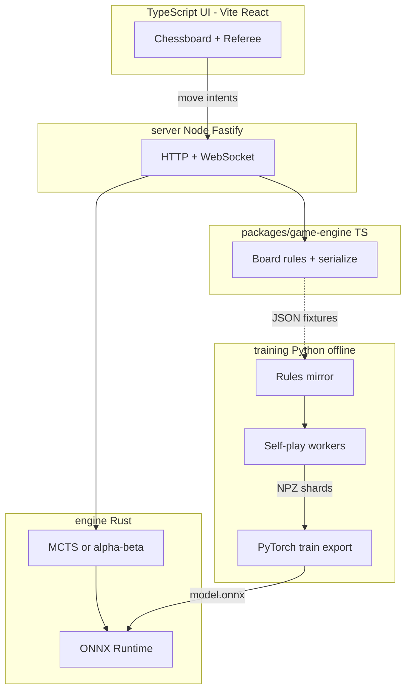
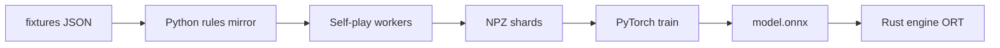

# Chesskers — Architecture Ground Truth

**Read this file first.** This document is the canonical reference for the Chesskers project. Future agents should pick a single milestone ID from [Section 7](#7-agent-milestone-checklist), verify prerequisites, implement only that scope, and check off the milestone when merged.

**Related docs:**

- [railway-vercel-migration.md](./railway-vercel-migration.md) — multiplayer wire protocol, server move pipeline, deployment detail
- [todo.md](./todo.md) — UI polish backlog (undo, redo, introduction)

---

## 1. Project overview

### What is Chesskers?

Chesskers is a chess/checkers hybrid played on an 8×8 board. White fields a standard chess army; black fields two checkers pieces with torus-wrapping movement. Win conditions are asymmetric — not standard chess checkmate.

### Project goal

Build a **separated architecture**:

| Component                  | Role                                                                                  |
| -------------------------- | ------------------------------------------------------------------------------------- |
| **React UI**               | Board rendering, input, sound, modals — no authoritative rules in online/engine modes |
| **TypeScript game-engine** | Canonical rules, serialization, shared `applyMove`                                    |
| **Rust engine**            | Fast search (MCTS / alpha-beta) + ONNX neural-network evaluation at play time         |
| **Python training**        | Offline self-play, PyTorch training, ONNX export                                      |
| **Node server**            | HTTP + WebSocket wrapper; spawns Rust engine for AI moves                             |

Components communicate **only** via versioned JSON schemas, golden fixtures, NPZ training shards, and ONNX model files. No runtime imports across language boundaries.

### Non-goals (v1)

- User authentication or accounts
- Persistent database (Postgres, Redis) — in-memory rooms only initially
- Horizontal scaling / multi-instance sync
- PGN export or move replay
- Timed games / clocks

---

## 2. Game rules reference

Rules documented here match the **current TypeScript implementation**. Rust and Python ports must pass the same golden fixtures — do not invent rules from chess or checkers conventions.

### 2.1 Initial setup

Source: `[src/Constants.ts](../src/Constants.ts)`

| Side                                   | Pieces                         | Positions                        |
| -------------------------------------- | ------------------------------ | -------------------------------- |
| **White** (`TeamType.OUR`, `"w"`)      | Full chess back rank + 8 pawns | Rows 0–1 (standard chess layout) |
| **Black** (`TeamType.OPPONENT`, `"b"`) | Two `checkers` pieces only     | `(3, 6)` and `(4, 6)`            |

There is no black chess army. Black's entire force is the two checkers.

`totalTurns` starts at **1**.

### 2.2 Turn model

Source: `[src/components/Referee/Referee.tsx](../src/components/Referee/Referee.tsx)`

- White moves when `totalTurns % 2 === 1` (odd).
- Black moves when `totalTurns % 2 === 0` (even).
- **Checkers hop lock:** when `checkersHopPosition` is set, only the checkers piece at that square may move. Turn parity checks are bypassed until the hop chain ends.
- After a valid checkers **jump**:
  - If further jumps exist from the landing square → set `checkersHopPosition` to landing; **do not** increment `totalTurns`.
  - Otherwise → clear `checkersHopPosition`; increment `totalTurns`.
- Non-jump moves (including chess moves and checkers steps) → clear hop lock; increment `totalTurns`.

### 2.3 Win conditions

Source: `[src/models/Board.ts](../src/models/Board.ts)` (`calculateAllMoves`, lines 69–83)

```typescript
if (!this.pieces.some((p) => p.team === TeamType.OPPONENT)) {
  this.winningTeam = TeamType.OUR; // white wins
}
if (!this.pieces.some((p) => p.isKing && p.team === TeamType.OUR)) {
  this.winningTeam = TeamType.OPPONENT; // black wins
}
```

| Winner            | Condition                  | Typical cause                   |
| ----------------- | -------------------------- | ------------------------------- |
| **White** (`"w"`) | No black pieces remain     | Both checkers captured          |
| **Black** (`"b"`) | No white **king** on board | King captured via checkers jump |

UI messages (`[Referee.tsx](../src/components/Referee/Referee.tsx)`):

- Black: `"Black wins — white king jumped and burgled!"`
- White: `"White wins — all black pieces captured!"`

There is no stalemate or draw detection in the current implementation.

### 2.4 Checkers piece rules

Source: `[src/referee/rules/CheckersRules.ts](../src/referee/rules/CheckersRules.ts)`

- **Step:** 1 square in any of 8 directions (king-like), to an empty square.
- **Jump:** 2 squares in any of 8 directions over an **adjacent opponent piece** to an empty landing square; jumped piece is removed.
- **Multi-hop:** mandatory continuation within the same turn when additional jumps exist (enforced via `checkersHopPosition`).
- **Torus wrapping:** only checkers use `wrapCoord()` from `[src/models/Position.ts](../src/models/Position.ts)`. Steps and jumps wrap at board edges.

Wrapped-edge behavior is tested in `[packages/game-engine/src/Board.test.ts](../packages/game-engine/src/Board.test.ts)`:

- Wrapped step across left edge: `(0,3) → (7,3)`
- Wrapped orthogonal hop: checkers at `(0,3)` jumps pawn at `(7,3)` to `(6,3)`
- Wrapped diagonal hop across corner: checkers at `(0,0)` jumps pawn at `(7,7)` to `(6,6)`

### 2.5 Chess piece rules

Standard chess movement for pawns, knights, bishops, rooks, queen, king — including castling and en passant. Chess pieces **do not** wrap; moves outside 0–7 are invalid (`[src/referee/rules/RookRules.ts](../src/referee/rules/RookRules.ts)` and siblings).

Castling moves are appended in `Board.calculateAllMoves()` after per-piece move generation.

### 2.6 Pawn promotion

When a pawn reaches rank **7** (white) or rank **0** (black):

- UI shows promotion modal (queen / rook / bishop / knight).
- In online and vs-engine modes, server sets `pendingPromotion` and emits `promote_required`; further moves blocked until `promote` message received.
- Promotion is **not** automatic — player (or engine policy) must choose piece type.

Pawn `enPassant` flag lives on `[src/models/Pawn.ts](../src/models/Pawn.ts)` and must serialize.

### 2.7 Logic split (critical for agents)

Today, game logic is split across two layers:

| Layer       | File                                                                          | Responsibilities                                                                                            |
| ----------- | ----------------------------------------------------------------------------- | ----------------------------------------------------------------------------------------------------------- |
| **Board**   | `[src/models/Board.ts](../src/models/Board.ts)`                               | Move generation, `playMove()` (movement + captures), win detection, castling                                |
| **Referee** | `[src/components/Referee/Referee.tsx](../src/components/Referee/Referee.tsx)` | Turn enforcement, en passant **detection**, checkers hop continuation, turn increment, promotion UI trigger |

**Target state:** consolidate Referee orchestration into `packages/game-engine` as:

```typescript
applyMove(board: Board, move: Move): ApplyMoveResult
// ApplyMoveResult includes: new Board, pendingPromotion?, gameOver?
```

UI, server, and tests must all call `applyMove` — not duplicate turn/hop logic.

---

## 3. Target architecture



### Language assignments (locked)

| Layer                 | Language                    | Location                |
| --------------------- | --------------------------- | ----------------------- |
| UI                    | TypeScript / React          | `[src/](../src/)`       |
| Rules package         | TypeScript                  | `packages/game-engine/` |
| Game server           | Node (Fastify) v1           | `server/`               |
| Search + NN inference | **Rust** + ONNX Runtime     | `engine/`               |
| NN training           | **Python** (PyTorch → ONNX) | `training/`             |

### Separation principle

**No runtime imports across language boundaries.** Shared artifacts only:

| Artifact                           | Purpose                                    |
| ---------------------------------- | ------------------------------------------ |
| `fixtures/*.json`                  | Golden positions exported from Vitest      |
| `SerializedBoard` JSON             | Wire format between UI, server, engine CLI |
| `training/shards/*.npz`            | Training data on disk                      |
| `engine/models/*.onnx`             | Exported neural network weights            |
| `training/configs/encoder_v1.yaml` | Tensor layout spec (created at T1-3)       |

---

## 4. Repository layout (target)

```
React-Chess/
  packages/
    game-engine/          # TS: Board, rules, serialize, applyMove
  engine/                   # Rust: rules port, search, ONNX, CLI
  server/                   # HTTP/WS wrapper for UI + multiplayer
  training/                 # Python: mirror, encoder, self-play, train
    configs/
      encoder_v1.yaml       # created at T1-3
    shards/
    models/
  fixtures/                 # Golden JSON from vitest exports
  src/                      # React UI (imports game-engine)
  docs/
    architecture.md         # THIS FILE
    railway-vercel-migration.md
    todo.md
```

### Current source files (pre-extraction)

| Path                                                                                                                            | Role                                      |
| ------------------------------------------------------------------------------------------------------------------------------- | ----------------------------------------- |
| `[src/models/Board.ts](../src/models/Board.ts)`                                                                                 | Core game state and move application      |
| `[src/models/Piece.ts](../src/models/Piece.ts)`, `[Pawn.ts](../src/models/Pawn.ts)`, `[Position.ts](../src/models/Position.ts)` | Piece models                              |
| `[src/referee/rules/](../src/referee/rules/)`                                                                                   | Per-piece move generation                 |
| `[src/Types.ts](../src/Types.ts)`                                                                                               | `PieceType`, `TeamType` enums             |
| `[src/Constants.ts](../src/Constants.ts)`                                                                                       | `initialBoard`, board dimensions, UI axes |
| `[src/components/Referee/Referee.tsx](../src/components/Referee/Referee.tsx)`                                                   | UI orchestration (to be thinned)          |
| `[src/components/Chessboard/Chessboard.tsx](../src/components/Chessboard/Chessboard.tsx)`                                       | Board rendering and drag input            |
| `[packages/game-engine/src/Board.test.ts](../packages/game-engine/src/Board.test.ts)`                                           | Rules regression tests                    |

---

## 5. Shared contracts

### 5.1 SerializedBoard (schemaVersion: 1)

```typescript
interface SerializedBoard {
  schemaVersion: 1;
  pieces: {
    x: number;
    y: number;
    type: "pawn" | "rook" | "bishop" | "knight" | "queen" | "king" | "checkers";
    team: "w" | "b";
    hasMoved: boolean;
    enPassant?: boolean; // pawns only
  }[];
  totalTurns: number;
  checkersHopPosition?: { x: number; y: number };
  winningTeam?: "w" | "b";
}
```

**Serialization rules:**

- **Include:** position, type, team, `hasMoved`, pawn `enPassant`
- **Exclude:** `possibleMoves`, `image` paths (derived from type + team on each client)
- After deserialize, always call `calculateAllMoves()` before accepting input or validating moves
- Bump `schemaVersion` if the wire format changes; never silently break Rust/Python ports

### 5.2 Move encoding

```typescript
interface Move {
  from: { x: number; y: number };
  to: { x: number; y: number };
  promotion?: "queen" | "rook" | "bishop" | "knight";
}
```

**Legal move list:** engine returns `Move[]` computed from current board state. UI highlights via `calculateAllMoves()` locally — do not sync `possibleMoves` over the wire.

### 5.3 Move index for NN policy head

Variable legal move count per position. Policy head uses a fixed logits vector with **legal-move masking**.

**Base index (v1 draft — finalize in** `training/configs/encoder_v1.yaml` **at T1-3):**

```
fromIndex = from.y * 8 + from.x   // 0..63
toIndex   = to.y * 8 + to.x       // 0..63
baseIndex = fromIndex * 64 + toIndex   // 0..4095
```

When `promotion` applies (pawn on 7th/2nd rank reaching back rank), add a promotion bucket offset:

```
promotionOffset = { queen: 0, rook: 4096, bishop: 8192, knight: 12288 }[promotion]
moveIndex = baseIndex + promotionOffset
```

Maximum policy logits: 16384 (4096 × 4 promotion choices). Mask illegal indices to `-inf` before softmax.

### 5.4 NN input encoding (encoder_v1)

Spec file: `training/configs/encoder_v1.yaml` (created at T1-3; loaded by the Python encoder and mirrored by `engine/src/encoder.rs`).

| Plane(s) | Description                                                           |
| -------- | --------------------------------------------------------------------- |
| 0–6      | White piece types (pawn, rook, bishop, knight, queen, king, checkers) |
| 7–13     | Black piece types (same order)                                        |
| 14       | Side to move (1.0 = white, 0.0 = black) — full 8×8 fill               |
| 15       | Checkers hop lock (1.0 at hop square, 0 elsewhere)                    |

**Tensor shape:** `[batch, 16, 8, 8]`

**Value head output:** scalar in `[-1, 1]` from **side-to-move** perspective (+1 = side to move wins, −1 = loses, 0 = draw/unknown).

**Policy head output:** logits vector (size per §5.3); masked to legal moves.

**Versioning:** breaking layout changes → `encoder_v2.yaml`; Rust and Python encoders must stay in sync via fixture comparison tests.

### 5.5 UI ↔ server WebSocket protocol

Full message tables: [railway-vercel-migration.md §5](./railway-vercel-migration.md#5-wire-protocol).

**Summary — client → server:**

```typescript
{ type: "join", gameId: string, playerToken?: string }
{ type: "move", from: { x, y }, to: { x, y } }
{ type: "promote", pieceType: "queen" | "rook" | "bishop" | "knight" }
{ type: "requestEngineMove" }   // vs-engine mode only
```

**Summary — server → client:**

```typescript
{ type: "joined", color: "w" | "b", board: SerializedBoard, playerToken: string }
{ type: "waiting" }
{ type: "state", board: SerializedBoard }
{ type: "promote_required", position: { x, y } }
{ type: "gameOver", winner: "w" | "b", reason: "capture_all" | "king_jumped" }
{ type: "engineThinking" }
{ type: "error", message: string }
```

**REST endpoints:**

| Method | Path                | Response                                    |
| ------ | ------------------- | ------------------------------------------- |
| `GET`  | `/health`           | `{ ok: true }`                              |
| `POST` | `/games`            | `{ gameId, initialState: SerializedBoard }` |
| `POST` | `/games/:id/engine` | `{ engineColor, model, thinkMs }`           |

Server move pipeline detail: [railway-vercel-migration.md §7](./railway-vercel-migration.md#7-server-side-move-pipeline).

### 5.6 Rust Evaluator trait (internal, in-process)

Not exposed over HTTP. Used inside the Rust engine between search and ONNX.

```rust
trait Evaluator {
    fn evaluate(&self, state: &GameState) -> EvalResult;
}

struct EvalResult {
    value: f32,                      // [-1, 1] from side-to-move POV
    policy: Vec<(Move, f32)>,        // optional; MCTS priors
}
```

---

## 6. Rust engine CLI

Documented interface for `engine/` binary (implemented at E1-5, E2-4). All commands read/write **JSON on stdin/stdout**.

```bash
# List legal moves for a position
echo '{"schemaVersion":1,...}' | chesskers-engine legal-moves

# Apply a move; prints new SerializedBoard or error
echo '{"board":{...},"move":{"from":{"x":3,"y":1},"to":{"x":3,"y":3}}}' | chesskers-engine apply-move

# Check terminal state
echo '{"schemaVersion":1,...}' | chesskers-engine is-terminal
# → {"terminal":true,"winner":"w"|"b"|null}

# Play a full random-vs-random game to terminal (E1-6)
echo '{"schemaVersion":1,...}' | chesskers-engine play-random --seed 42
# → {"terminal":true,"winner":"w"|"b","movesPlayed":N}

# Play one engine move (E2-4)
chesskers-engine best-move --model engine/models/v001.onnx --think-ms 2000 --depth 4 < board.json
# → {"move":{"from":{...},"to":{...},"promotion?":"queen"}}
```

Server spawns `best-move` as a child process or links the crate directly — pick one at S1-4; document choice in server README.

---

## 7. Agent milestone checklist

Each milestone is **independently assignable**. Before starting:

1. Read this document fully.
2. Confirm prerequisite milestones are checked off below.
3. Implement only what "Done when" specifies.
4. Check off the milestone checkbox when merged.

---

### M0 — Game engine extraction (TypeScript)

- [x] **M0-1** — Scaffold `packages/game-engine`
  - **Prerequisites:** none
  - **Touch:** `packages/game-engine/` (`package.json`, `tsconfig.json`, vitest config)
  - **Done when:** `npm test` in package passes (empty or stub suite)

- [x] **M0-2** — Move core logic into game-engine
  - **Prerequisites:** M0-1
  - **Touch:** move `src/models/`, `src/referee/rules/`, `src/Types.ts` → game-engine; update `src/` imports
  - **Done when:** no duplicate model/rule files in `src/`; frontend builds

- [x] **M0-3** — Split constants
  - **Prerequisites:** M0-2
  - **Touch:** `[src/Constants.ts](../src/Constants.ts)` → game-engine board constants + `src/constants/ui.ts` for `VERTICAL_AXIS`, `HORIZONTAL_AXIS`
  - **Done when:** `initialBoard` lives in game-engine; UI axes in `src/`

- [x] **M0-4** — Board serialization
  - **Prerequisites:** M0-2
  - **Touch:** game-engine `serializeBoard` / `deserializeBoard`
  - **Done when:** round-trip test passes; output matches [§5.1](#51-serializedboard-schemaversion-1)

- [x] **M0-5** — Extract `applyMove()`
  - **Prerequisites:** M0-2
  - **Touch:** game-engine + `[Referee.tsx](../src/components/Referee/Referee.tsx)`
  - **Done when:** turn, hop, en passant, promotion-pending logic in game-engine; Referee delegates; `[Board.test.ts](../packages/game-engine/src/Board.test.ts)` passes

- [x] **M0-6** — Move tests to game-engine
  - **Prerequisites:** M0-5
  - **Touch:** move `[Board.test.ts](../packages/game-engine/src/Board.test.ts)` → game-engine; wire root `npm test`
  - **Done when:** CI / root test script green

- [x] **M0-7** — Export golden fixtures
  - **Prerequisites:** M0-6
  - **Touch:** `fixtures/*.json`, export script in game-engine
  - **Done when:** one JSON file per significant test case; format documented in [§8](#8-fixture-format)

---

### E1 — Rust engine shell

- [x] **E1-1** — Scaffold Rust crate
  - **Prerequisites:** M0-7
  - **Touch:** `engine/` (`cargo init`, `Cargo.toml`)
  - **Done when:** `cargo build` succeeds

- [x] **E1-2** — Port SerializedBoard types
  - **Prerequisites:** E1-1
  - **Touch:** `engine/src/state.rs` (or equivalent)
  - **Done when:** parses all files in `fixtures/`

- [x] **E1-3** — Port move generation + win detection
  - **Prerequisites:** E1-2
  - **Touch:** `engine/src/rules/`
  - **Done when:** `cargo test` legal-move and terminal assertions match fixtures

- [x] **E1-4** — Port `apply_move`
  - **Prerequisites:** E1-3
  - **Touch:** `engine/src/apply.rs`
  - **Done when:** fixture replay tests pass end-to-end (sequence of moves → expected board)

- [x] **E1-5** — CLI commands
  - **Prerequisites:** E1-4
  - **Touch:** `engine/src/main.rs`
  - **Done when:** `legal-moves`, `apply-move`, `is-terminal` work per [§6](#6-rust-engine-cli)

- [x] **E1-6** — Random-move bot
  - **Prerequisites:** E1-5
  - **Touch:** `engine/`
  - **Done when:** CLI plays a full random-vs-random game to terminal without illegal moves

---

### E2 — Search + ONNX (Rust)

- [x] **E2-1** — Board → tensor encoder (Rust)
  - **Prerequisites:** E1-4
  - **Touch:** `engine/src/encoder.rs`
  - **Done when:** matches Python encoder on all fixtures (T1-3 provides reference) or documented float tolerance

- [x] **E2-2** — ONNX Runtime integration
  - **Prerequisites:** E2-1
  - **Touch:** `engine/` (add `ort` or `tract` dependency)
  - **Done when:** loads dummy or v001 ONNX; `evaluate` returns finite value

- [x] **E2-3** — Search with value-only NN
  - **Prerequisites:** E2-2
  - **Touch:** `engine/src/search.rs`
  - **Done when:** beats E1-6 random bot >90% over 100-game suite

- [x] **E2-4** — `best-move` CLI
  - **Prerequisites:** E2-3
  - **Touch:** `engine/src/main.rs`
  - **Done when:** returns legal move within `--think-ms` budget per [§6](#6-rust-engine-cli)

---

### S1 — Server + UI vs engine

- [x] **S1-1** — Scaffold server
  - **Prerequisites:** M0-4
  - **Touch:** `server/` (Fastify + `ws`)
  - **Done when:** `GET /health` → `{ ok: true }`

- [x] **S1-2** — Create game endpoint
  - **Prerequisites:** S1-1, M0-4
  - **Touch:** `server/src/routes.ts`
  - **Done when:** `POST /games` returns `{ gameId, initialState }`

- [x] **S1-3** — WebSocket move pipeline
  - **Prerequisites:** S1-2, M0-5
  - **Touch:** `server/`
  - **Done when:** authoritative moves work; see [migration doc §7](./railway-vercel-migration.md#7-server-side-move-pipeline); local two-tab test passes

- [x] **S1-4** — Engine integration
  - **Prerequisites:** S1-3, E2-4
  - **Touch:** `server/` + engine binary
  - **Done when:** `POST /games/:id/engine` enables AI; `requestEngineMove` triggers Rust `best-move` and broadcasts `state`

- [x] **S1-5** — React vs-engine mode
  - **Prerequisites:** S1-4
  - **Touch:** `[Referee.tsx](../src/components/Referee/Referee.tsx)`, lobby route
  - **Done when:** full game vs engine in browser; local hot-seat still works

**Multiplayer (two humans) — S1-M sub-track:**

Follow checklist in [railway-vercel-migration.md §12](./railway-vercel-migration.md#12-implementation-checklist) items 11–16 (React Router, env vars, `useGameRoom`, deploy). Do not duplicate that checklist here.

---

### T1 — Python training pipeline (offline)

- [x] **T1-1** — Scaffold training package
  - **Prerequisites:** M0-7
  - **Touch:** `training/requirements.txt`, `training/README.md`
  - **Done when:** `pip install -r requirements.txt` succeeds (torch, numpy, onnx, pyyaml)

- [x] **T1-2** — Python rules mirror
  - **Prerequisites:** T1-1
  - **Touch:** `training/chesskers/` rules module
  - **Done when:** `pytest` passes all `fixtures/` assertions (legal moves, terminals, apply-move sequences)

- [x] **T1-3** — Python board encoder
  - **Prerequisites:** T1-2
  - **Touch:** `training/chesskers/encoder.py`, `training/configs/encoder_v1.yaml`
  - **Done when:** encoder output matches E2-1 Rust encoder on fixtures

- [ ] **T1-4** — Self-play shard writer
  - **Prerequisites:** T1-2
  - **Touch:** `training/self_play.py`
  - **Done when:** generates 1000+ positions to `training/shards/` as NPZ (states, outcomes; policy targets optional until T1-6)

- [ ] **T1-5** — Value-only CNN + ONNX export
  - **Prerequisites:** T1-3, T1-4
  - **Touch:** `training/train.py`, `training/models/v001.onnx`
  - **Done when:** ONNX loads in Rust E2-2; measurable improvement over random in 100-game suite

- [ ] **T1-6** — Policy + value head + MCTS self-play
  - **Prerequisites:** T1-5, E2-3
  - **Touch:** `training/`, `engine/`
  - **Done when:** `v002.onnx` beats `v001.onnx` >55% in fixed evaluation suite

- [ ] **T1-7** — Iterative training workflow
  - **Prerequisites:** T1-6
  - **Touch:** `training/promote.py` or documented script
  - **Done when:** `vNNN.onnx` naming convention documented; promotion criteria (55% win rate) scripted

---

### P1 — UI polish (non-blocking)

- [ ] **P1-1** — Undo / redo
  - **Prerequisites:** M0-5
  - **Touch:** Referee, move history stack
  - **Done when:** see [todo.md](./todo.md)

- [ ] **P1-2** — Introduction / rules page
  - **Prerequisites:** none
  - **Touch:** `src/` static page + lobby link
  - **Done when:** rules page reachable from app entry

- [ ] **P1-3** — Engine strength selector
  - **Prerequisites:** S1-5
  - **Touch:** UI settings
  - **Done when:** user can set depth / think-ms before vs-engine game

---

## 8. Testing strategy

| Layer       | Tool                             | What it validates                              |
| ----------- | -------------------------------- | ---------------------------------------------- |
| TypeScript  | vitest in `packages/game-engine` | Rules regression, serialize round-trip         |
| Fixtures    | `fixtures/*.json`                | Single source of truth for Rust + Python ports |
| Rust        | `cargo test`                     | Loads same fixtures as TS/Python               |
| Python      | `pytest`                         | Loads same fixtures                            |
| Integration | 100-game Rust vs Rust suite      | Run after each model promotion (T1-7)          |

**Rules:**

- Export fixtures from TS tests (M0-7); never hand-author fixture JSON without a TS test backing it.
- **Do not** subprocess to Node from Python in the training hot loop.
- **Do not** share source code across Rust and Python — share fixtures and encoder YAML spec.

### Fixture format

Each file in `fixtures/` (created at M0-7):

```json
{
  "name": "declares_black_winner_when_white_king_hopped",
  "board": { "schemaVersion": 1, "pieces": [...], "totalTurns": 2 },
  "action": {
    "move": { "from": { "x": 4, "y": 6 }, "to": { "x": 2, "y": 4 } }
  },
  "expect": {
    "winningTeam": "b",
    "pieceCount": 1,
    "legalMovesFrom": null
  }
}
```

Exact schema may vary by test type (position-only vs move-sequence). Document the export script output in game-engine README when M0-7 lands.

---

## 9. Training pipeline (offline)

Training runs entirely in `training/` with no live connection to UI or server.



### Stage A — Value-only (T1-4, T1-5)

|             |                                                                                                                    |
| ----------- | ------------------------------------------------------------------------------------------------------------------ |
| **Entry**   | Fixtures pass in Python; random bot exists in Rust                                                                 |
| **Process** | Self-play with random/heuristic opponents → outcome labels per position → train small CNN value head → export ONNX |
| **Exit**    | `v001.onnx` loaded in Rust; engine beats random >90%                                                               |

### Stage B — Policy + value (T1-6)

|             |                                                                                |
| ----------- | ------------------------------------------------------------------------------ |
| **Entry**   | Value-only model promoted                                                      |
| **Process** | MCTS with NN value + policy priors → train on `(state, visit_counts, outcome)` |
| **Exit**    | `v002.onnx` beats `v001.onnx` >55% in suite                                    |

### Stage C — Iterative (T1-7)

|             |                                                                                                                                          |
| ----------- | ---------------------------------------------------------------------------------------------------------------------------------------- |
| **Entry**   | Stage B complete                                                                                                                         |
| **Process** | Worker pool: `self_play --model vNNN.onnx --games N --out shards/` → nightly `train.py` → candidate model → eval suite → promote if >55% |
| **Exit**    | Documented repeatable loop; models in `engine/models/vNNN.onnx`                                                                          |

**Value target semantics:** +1 / −1 / 0 from side-to-move perspective at terminal positions; bootstrap from game outcome for non-terminal positions during early training.

---

## 10. Deployment

| Host        | Artifact                  | Serves                                     |
| ----------- | ------------------------- | ------------------------------------------ |
| **Vercel**  | `npm run build` → `dist/` | Static React SPA                           |
| **Railway** | `server/` Node process    | HTTP, WebSocket, spawns Rust engine binary |
| **Local**   | all services              | Dev workflow                               |

**Environment variables:**

| Variable             | Where          | Purpose                                             |
| -------------------- | -------------- | --------------------------------------------------- |
| `VITE_API_URL`       | Vercel build   | Railway HTTP base                                   |
| `VITE_WS_URL`        | Vercel build   | Railway WebSocket base                              |
| `ENGINE_BINARY_PATH` | Railway server | Path to Rust `chesskers-engine` binary              |
| `MODEL_PATH`         | Railway server | Default ONNX model (e.g. `engine/models/v003.onnx`) |
| `PORT`               | Railway server | HTTP/WS listen port                                 |

Full deployment detail: [railway-vercel-migration.md §9](./railway-vercel-migration.md#9-deployment-split).

---

## 11. Known limitations and upgrade paths

### Multiplayer / server (from migration doc)

| Limitation                  | Impact                         | Upgrade path               |
| --------------------------- | ------------------------------ | -------------------------- |
| In-memory rooms             | Games lost on redeploy/crash   | Redis or Postgres          |
| No authentication           | Anyone with `gameId` can join  | Room passwords or auth     |
| Room ID is the secret       | Guessable IDs are joinable     | UUIDs; private rooms       |
| No move history             | No replay                      | Append-only move log in DB |
| No rate limiting            | Spamable                       | Per-IP throttle            |
| Single Railway instance     | No horizontal scaling          | Redis pub/sub              |
| `playerToken` not persisted | Reconnect fails after redeploy | Store tokens in Redis      |

### Engine / training

| Limitation                      | Impact                                   | Upgrade path                                |
| ------------------------------- | ---------------------------------------- | ------------------------------------------- |
| Model not on persistent volume  | Railway redeploy resets to default model | Mount volume or S3 fetch for `MODEL_PATH`   |
| Rules duplicated in 3 languages | Drift risk                               | Fixtures CI gate on every PR                |
| No draw detection               | Games run until terminal win             | Add repetition / move-limit rules if needed |
| 16384-move policy space         | Sparse for early training                | Stage A value-only first; mask aggressively |

### Future upgrades (out of scope v1)

- Redis persistence, spectators, rematch, timed games — see [migration doc §11](./railway-vercel-migration.md#11-future-upgrades-out-of-scope-for-v1)
- Board flip for black player online
- Analysis mode / eval bar in UI
- Engine opening book

---

## 12. Agent operating instructions

1. **Read this file fully** before starting any task.
2. **Pick one milestone ID** (e.g. M0-4, E1-3). Verify all prerequisites are checked off.
3. **Stay in scope.** Do not expand beyond that milestone's "Done when" criteria.
4. **Never share code** across Rust and Python. Share `fixtures/` and `encoder_v1.yaml` only.
5. **Bump versions** if you break wire format (`schemaVersion`) or tensor layout (`encoder_v2`).
6. **Check off the milestone** in [Section 7](#7-agent-milestone-checklist) when your PR merges.
7. **Do not sync** `possibleMoves` **over the wire.** Both sides call `calculateAllMoves()` locally.
8. **Consolidate Referee logic** into game-engine when touching move application — do not add a fourth copy in server code.
9. **Promotion is two-step** in server/engine modes: move → `promote_required` → `promote`. Engine must handle pending promotion in search state.
10. **Checkers torus wrapping** applies only to `PieceType.CHECKERS` — chess pieces clip at board edges.

---

## 13. Glossary

| Term                | Meaning                                                                                 |
| ------------------- | --------------------------------------------------------------------------------------- |
| **Chesskers**       | This project's hybrid chess/checkers game                                               |
| **Hop lock**        | `checkersHopPosition` state during a multi-jump checkers turn                           |
| **SerializedBoard** | Versioned JSON wire format for game state ([§5.1](#51-serializedboard-schemaversion-1)) |
| **Side to move**    | White on odd `totalTurns`, black on even — unless hop lock active                       |
| **Fixture**         | Golden JSON test case exported from Vitest ([§8](#8-fixture-format))                    |
| **OUR / OPPONENT**  | TS enum names for white (`"w"`) and black (`"b"`)                                       |
| **encoder_v1**      | 16-plane 8×8 tensor layout for NN input ([§5.4](#54-nn-input-encoding-encoder_v1))      |
| **Shard**           | NPZ file of training positions written by self-play                                     |
| **Promotion**       | Pawn reaching back rank; requires explicit piece-type choice                            |

---

## Document history

| Date       | Change                                                                                                        |
| ---------- | ------------------------------------------------------------------------------------------------------------- |
| 2026-07-06 | Initial ground truth — UI / Rust engine / Python training architecture, milestone checklist, shared contracts |
