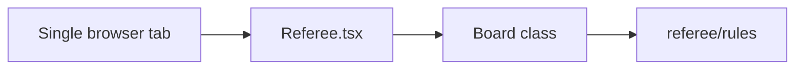
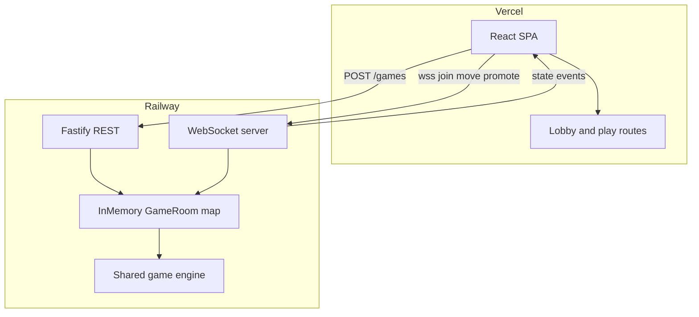
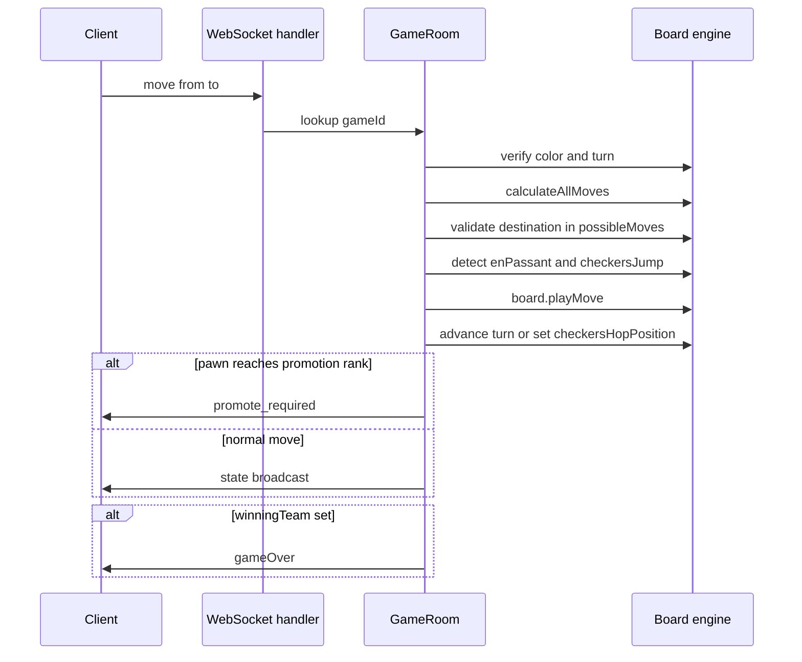

# Railway + Vercel Migration Guide

Architecture and migration plan for splitting React-Chess into a Vercel-hosted frontend and a Railway-hosted multiplayer game server.

---

## 1. Executive summary

**Today:** React-Chess is a single-browser, hot-seat game. All state lives in React on one device — there is no networking, no rooms, and no way for two people on different machines to share a game.

**Goal:** Deploy the static React app on **Vercel** and run an authoritative game server on **Railway**. Friends create a game, share a link, and play in real time.

**Why Railway for the backend:** Chess needs persistent, bidirectional connections (WebSockets). Vercel serverless functions cannot hold long-lived WebSocket sessions. Railway runs a persistent Node process, which is the right fit for a small realtime game server.

**Why not a generic chess library:** This project uses custom rules — a chess/checkers hybrid, custom win conditions, and checkers multi-hop logic. The existing `Board` class and `referee/rules` must be shared between client and server rather than replaced by lichess-style APIs.

---

## 2. Current architecture (as-is)



### What exists today

| Concern | Location | Notes |
|---------|----------|-------|
| Game state | `src/models/Board.ts` | `pieces`, `totalTurns`, `checkersHopPosition`, `winningTeam` |
| Move application | `Board.playMove()` | Castling, en passant, captures, checkers jumps |
| Move legality | `Board.calculateAllMoves()` + `referee/rules/` | Per-piece rules, turn filtering |
| UI orchestration | `src/components/Referee/Referee.tsx` | Turn checks, en passant detection, checkers hop logic, promotion modal, game-over |
| Board rendering | `src/components/Chessboard/Chessboard.tsx` | Drag-and-drop input |
| Build | `package.json` | Vite → `dist` |

### Key behaviors owned by Referee (not Board alone)

`Referee.playMove` (lines 63–267) does more than call `Board.playMove`:

1. **Turn enforcement** — white moves on odd `totalTurns`, black on even (unless a checkers hop is in progress).
2. **Checkers hop lock** — when `checkersHopPosition` is set, only that piece may move.
3. **En passant detection** — `isEnPassantMove()` before calling `board.playMove`.
4. **Checkers jump detection** — `isCheckersJump()` to decide whether turn advances or hop continues.
5. **Turn advancement** — increments `totalTurns` or sets `checkersHopPosition` after a valid move.
6. **Pawn promotion** — shows modal locally; `promotePawn()` swaps piece type client-side.
7. **Game over** — reads `winningTeam` from board after `calculateAllMoves`.

### What is missing

- No HTTP API or WebSocket layer
- No board serialization (`clone()` exists; no `toJSON` / `fromJSON`)
- No routing (single page, no `/play/:gameId`)
- No per-player identity (both colors playable in one tab)
- No environment config for external services

---

## 3. Target architecture (to-be)



### Stack decisions

| Piece | Choice | Rationale |
|-------|--------|-----------|
| Frontend host | Vercel | Existing Vite SPA; static `dist` output |
| Backend host | Railway | Persistent process; WebSockets supported |
| HTTP framework | Fastify | Lightweight; health check + create-room endpoint |
| Realtime | Native `ws` on same port as HTTP | Chess only needs JSON messages; no Socket.io fallbacks needed |
| Game state (v1) | In-memory `Map<gameId, GameRoom>` | Sufficient for friends-only play |
| Authority | Server applies moves | Client is view + input; prevents cheating |

### Authority model

The server becomes the referee. The browser:

- Renders board state received from the server
- Sends move intents over WebSocket
- Does **not** mutate authoritative game state in online mode

Local hot-seat mode (optional) can remain as a fallback with no server connection.

---

## 4. Proposed repo layout

```
React-Chess/
  packages/
    game-engine/          # shared logic (extract from src/)
      models/             # Board, Piece, Pawn, Position
      referee/rules/      # all rule modules
      Types.ts
      boardConstants.ts   # initialBoard only (not UI constants)
  server/                 # Railway service (future)
    src/
      index.ts            # Fastify + WebSocket entry
      rooms.ts            # GameRoom map and lifecycle
      ws.ts               # message handlers
      routes.ts           # POST /games, GET /health
  src/                    # Vite frontend
    components/           # Referee, Chessboard, etc.
    hooks/                # useGameRoom (future)
  docs/
    railway-vercel-migration.md
```

### Why `packages/game-engine`

Extract these from `src/` into a shared package:

- `src/models/` — `Board.ts`, `Piece.ts`, `Pawn.ts`, `Position.ts`
- `src/referee/rules/` — all rule modules
- `src/Types.ts`
- Board-related exports from `src/Constants.ts` (`initialBoard`, dimensions)

Both the Vite app and the Railway server import from `game-engine`. This guarantees the server validates moves with the same rules as the client preview.

**Do not sync `possibleMoves` over the wire** — both sides call `calculateAllMoves()` locally after deserializing board state.

---

## 5. Wire protocol

Contract between the Vercel frontend and the Railway server.

### REST

| Method | Path | Response | Purpose |
|--------|------|----------|---------|
| `GET` | `/health` | `{ ok: true }` | Railway health probe |
| `POST` | `/games` | `{ gameId: string }` | Create a new game room |

The frontend builds the invite URL: `https://<vercel-domain>/play/<gameId>`.

### WebSocket — client to server

All messages are JSON with a `type` field.

```ts
// Join or rejoin a game
{ type: "join", gameId: string, playerToken?: string }

// Attempt a move (server validates)
{ type: "move", from: { x: number, y: number }, to: { x: number, y: number } }

// Choose promotion piece (only when server has sent promote_required)
{ type: "promote", pieceType: "queen" | "rook" | "bishop" | "knight" }
```

### WebSocket — server to client

```ts
// Assigned seat and current board
{ type: "joined", color: "w" | "b", board: SerializedBoard, playerToken: string }

// Only one player connected so far
{ type: "waiting" }

// Board snapshot after any valid state change
{ type: "state", board: SerializedBoard }

// Pawn reached promotion rank; server blocks further moves until promote
{ type: "promote_required", position: { x: number, y: number } }

// Game ended
{ type: "gameOver", winner: "w" | "b" }

// Invalid action or protocol error
{ type: "error", message: string }
```

### Seat assignment

| Connection order | Color | `TeamType` |
|------------------|-------|------------|
| First | White | `OUR` (`"w"`) |
| Second | Black | `OPPONENT` (`"b"`) |
| Third+ | Rejected or spectator (v1: reject) | — |

### `playerToken`

Opaque string issued on `joined`. Stored in `localStorage` so a disconnected player can rejoin the same seat. v1 can issue tokens without persisting them across Railway redeploys (see limitations).

---

## 6. Board serialization

Serialization does not exist today. Implement `serializeBoard(board: Board): SerializedBoard` and `deserializeBoard(data: SerializedBoard): Board` in `game-engine`.

### Wire format

```ts
interface SerializedBoard {
  pieces: SerializedPiece[];
  totalTurns: number;
  checkersHopPosition?: { x: number; y: number };
  winningTeam?: "w" | "b";
}

interface SerializedPiece {
  x: number;
  y: number;
  type: PieceType;       // "pawn" | "rook" | ... | "checkers"
  team: TeamType;        // "w" | "b"
  hasMoved: boolean;
  enPassant?: boolean;   // only for pawns (see Pawn.ts)
}
```

### Rules

- **Include:** position, type, team, `hasMoved`, pawn `enPassant`
- **Exclude:** `possibleMoves`, `image` paths (derived from type + team on each side)
- After deserialize, always call `calculateAllMoves()` before accepting input or validating a move

---

## 7. Server-side move pipeline

Map current `Referee.playMove` logic to server handlers. The server runs this sequence on every `move` message:



### Step-by-step

1. **Verify socket color** — moving piece `team` must match the socket's assigned color.
2. **Verify turn** — same parity rules as `Referee.tsx` lines 73–86:
   - If `checkersHopPosition` is set, only that piece may move.
   - Else white (`OUR`) moves when `totalTurns % 2 === 1`.
   - Else black (`OPPONENT`) moves when `totalTurns % 2 === 0`.
3. **Recompute moves** — `board.calculateAllMoves()` on the server copy.
4. **Validate destination** — `to` must be in the piece's `possibleMoves`.
5. **Detect special moves** — extract `isEnPassantMove` and `isCheckersJump` from Referee into shared helpers in `game-engine`.
6. **Apply move** — `board.playMove(enPassantMove, validMove, piece, destination)`.
7. **Advance turn or hop** — mirror Referee lines 173–211:
   - Checkers jump with more jumps available → set `checkersHopPosition`, do not increment `totalTurns`.
   - Otherwise → clear `checkersHopPosition`, increment `totalTurns`.
8. **Promotion check** — if a pawn lands on rank 0 (black) or rank 7 (white), set `room.pendingPromotion` and emit `promote_required`. Block further moves until `promote` arrives.
9. **Broadcast** — send `state` to both connected sockets.
10. **Game over** — if `winningTeam` is set after `calculateAllMoves`, emit `gameOver`.

### `promote` handler

1. Verify socket owns `pendingPromotion`.
2. Replace pawn at promotion square with chosen piece type (same as `Referee.promotePawn`).
3. Clear `pendingPromotion`, call `calculateAllMoves()`, broadcast `state`.

### `GameRoom` structure (in memory)

```ts
interface GameRoom {
  id: string;
  board: Board;
  whiteSocket?: WebSocket;
  blackSocket?: WebSocket;
  whiteToken?: string;
  blackToken?: string;
  pendingPromotion?: { player: TeamType; position: Position };
  createdAt: number;
}
```

---

## 8. Frontend migration steps

Ordered phases for implementing multiplayer on the Vercel side.

### Phase 1 — Routing

Add a client router (e.g. React Router):

- `/` — lobby: "Create game" button, optional "Join with code"
- `/play/:gameId` — game view; connects to WebSocket on mount

### Phase 2 — Environment config

Frontend reads Railway URLs at build time:

- `VITE_API_URL` — Railway HTTP base (e.g. `https://your-service.up.railway.app`)
- `VITE_WS_URL` — Railway WebSocket base (e.g. `wss://your-service.up.railway.app`)

Set these in Vercel project settings per environment.

### Phase 3 — Extract `game-engine`

Move shared logic into `packages/game-engine`. Update Vite and server to import from it. Existing tests in `src/Board.test.ts` move with the engine.

### Phase 4 — `useGameRoom` hook

```ts
// Conceptual API
function useGameRoom(gameId: string): {
  board: Board | null;
  myColor: TeamType | null;
  status: "connecting" | "waiting" | "playing" | "gameOver" | "error";
  sendMove: (from: Position, to: Position) => void;
  sendPromotion: (pieceType: PieceType) => void;
  error: string | null;
}
```

Responsibilities:

- Open WebSocket to Railway
- Send `join` on connect; persist `playerToken` in `localStorage`
- Deserialize incoming `state` / `joined` into `Board`
- Expose `sendMove` / `sendPromotion` for Referee

### Phase 5 — Refactor Referee

Split Referee into local and online paths, or pass a mode flag:

| Behavior | Local (hot-seat) | Online |
|----------|------------------|--------|
| Board state | `useState` + `setBoard` | From `useGameRoom` |
| `playMove` | Current logic | `sendMove(from, to)` |
| Turn enforcement | Client-side | Server-side; client disables wrong pieces |
| Promotion | Local modal | Modal on `promote_required`; `sendPromotion` |
| Game over | Local modal | On `gameOver` event |

**Input gating in online mode:**

- Disable drag when `piece.team !== myColor`
- Disable drag when not your turn (compare `board.currentTeam` to `myColor`)
- Respect `checkersHopPosition` visually (already in Chessboard)

### Phase 6 — Optional polish

- Flip board orientation for black player
- Connection status indicator ("Waiting for opponent…", "Reconnecting…")
- "Copy invite link" button on lobby and waiting screen
- Keep local hot-seat as `/local` or a toggle on the lobby

---

## 9. Deployment split

| Host | What deploys | What it serves |
|------|--------------|----------------|
| **Vercel** | `npm run build` → `dist/` | Static React SPA, assets from `public/` (`/sounds/`, `/assets/images/`) |
| **Railway** | `server/` Node process | `GET /health`, `POST /games`, WebSocket on same `PORT` |

### Cross-origin

- Railway Fastify registers CORS for the Vercel origin only.
- Frontend connects via `wss://` to Railway's public URL (not `localhost` in production).
- Railway service binds to `0.0.0.0` so the platform proxy can reach it.

### What each platform does not do

- **Vercel** does not run the game server or hold WebSocket connections.
- **Railway** does not serve the React build (unless you add static file serving, which is unnecessary — Vercel handles that).

---

## 10. MVP scope and known limitations

Intentional v1 ceilings:

| Limitation | Impact | Upgrade path |
|------------|--------|--------------|
| In-memory rooms | Games lost on Railway redeploy or crash | Redis or Postgres persistence |
| No authentication | Anyone with `gameId` can join | Optional room passwords or auth |
| Room ID is the secret | Short/guessable IDs are joinable | Use UUIDs; optional private rooms |
| No move history | No replay or PGN export | Append-only move log in DB |
| No rate limiting | Theoretically spamable | Per-IP throttle on Railway |
| Single Railway instance | No horizontal scaling | Redis pub/sub across replicas |
| `playerToken` not persisted server-side | Reconnect fails after redeploy | Store tokens in Redis |

---

## 11. Future upgrades (out of scope for v1)

- **Redis** — room state persistence, multi-instance broadcast, reconnect tokens
- **Board flip** — black player sees their pieces at the bottom
- **Spectators** — read-only WebSocket connections
- **Rematch** — reset board in same room after `gameOver`
- **Move audit log** — server-side record for dispute resolution
- **Timed games** — clock per player (requires server-side timer)

---

## 12. Implementation checklist

Use this ordered list when building. Each step should be mergeable independently where possible.

1. [ ] Remove `/docs` from `.gitignore` and commit this document
2. [ ] Create `packages/game-engine` — move `models/`, `referee/rules/`, `Types.ts`, board constants
3. [ ] Add `serializeBoard` / `deserializeBoard` to game-engine
4. [ ] Extract `isEnPassantMove` and checkers turn logic from Referee into game-engine helpers
5. [ ] Update frontend imports to use `game-engine`; confirm existing tests pass
6. [ ] Scaffold `server/` — Fastify, `GET /health`, `POST /games`, WebSocket on same port
7. [ ] Implement `GameRoom` in-memory map and `join` handler with seat assignment
8. [ ] Implement server move pipeline (section 7) with `state` broadcast
9. [ ] Implement `promote_required` / `promote` flow
10. [ ] Implement `gameOver` broadcast
11. [ ] Add React Router — `/` lobby, `/play/:gameId`
12. [ ] Add `VITE_API_URL` and `VITE_WS_URL` to frontend
13. [ ] Implement `useGameRoom` hook
14. [ ] Refactor Referee for online mode (server-driven state, input gating)
15. [ ] Deploy server to Railway; deploy frontend to Vercel; set CORS and env vars
16. [ ] Smoke test: create game, open invite link in second browser, play full game including promotion and checkers hop

---

## Related files (current codebase)

| File | Role in migration |
|------|-------------------|
| `src/components/Referee/Referee.tsx` | Split local/online; move detection helpers to game-engine |
| `src/models/Board.ts` | Core engine; add serialization |
| `src/models/Pawn.ts` | `enPassant` field must serialize |
| `src/referee/rules/` | Shared with server via game-engine |
| `src/Constants.ts` | Split UI constants from `initialBoard` |
| `src/components/Chessboard/Chessboard.tsx` | Add orientation flip (optional); input already piece-based |
| `package.json` | Vite build unchanged for Vercel |
| `.gitignore` | `docs/` now tracked |
