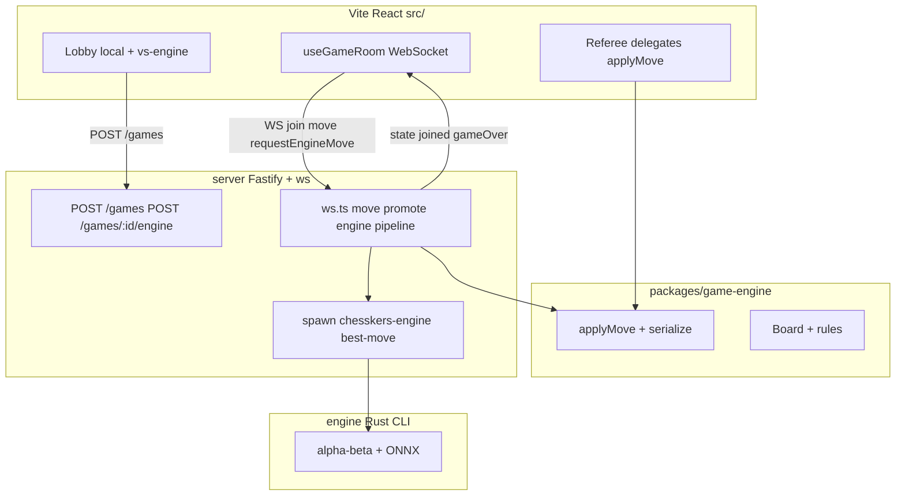
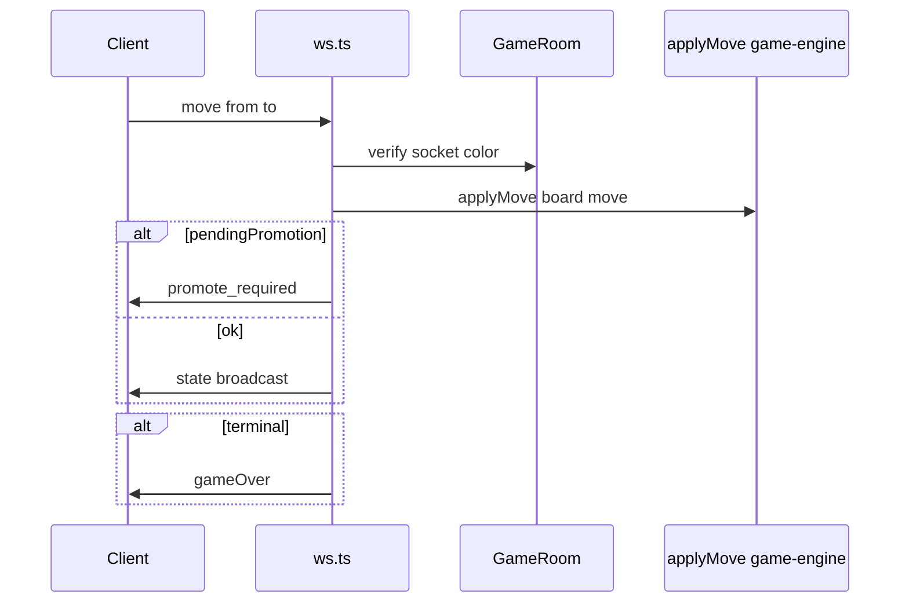

# Railway + Vercel Migration Guide

Deployment and wire-protocol reference for the Chesskers split: Vercel-hosted React frontend and Railway-hosted authoritative game server.

**Canonical architecture:** [architecture.md](./architecture.md). **Local dev:** [toplay.md](./toplay.md).

---

## 1. Executive summary

**Original goal:** Split a single-browser hot-seat app into a Vercel static SPA plus a Railway Node server so friends can play in real time.

**Implemented today (v1):**

| Capability | Status |
|------------|--------|
| `packages/game-engine` shared rules + `applyMove` + serialization | Done (M0) |
| Fastify + WebSocket server with authoritative moves | Done (S1) |
| Local hot-seat mode (no server) | Done |
| Vs-engine mode (human vs Rust ONNX engine) | Done (S1-4, S1-5) |
| Two-human multiplayer with invite links | **Not wired in UI** — server supports two seats; frontend has no `/play/:gameId` route yet (S1-M) |

**Why Railway for the backend:** Chesskers needs persistent, bidirectional WebSocket connections. Vercel serverless cannot hold long-lived WS sessions. Railway runs a persistent Node process.

**Why not a generic chess library:** Custom rules — chess/checkers hybrid, asymmetric win conditions, torus-wrapping checkers, multi-hop logic. Rules live in `packages/game-engine` and are mirrored in Rust/Python via fixtures.

---

## 2. Current architecture (implemented)



### What exists today

| Concern | Location | Notes |
|---------|----------|-------|
| Game state | [`packages/game-engine/src/models/Board.ts`](../packages/game-engine/src/models/Board.ts) | `pieces`, `totalTurns`, `checkersHopPosition`, `winningTeam`, `isDraw` |
| Move orchestration | [`packages/game-engine/src/applyMove.ts`](../packages/game-engine/src/applyMove.ts) | Turn, hop lock, en passant, promotion gate — used by UI **and** server |
| Move application | `Board.playMove()` | Physical movement, captures, castling |
| Move legality | `Board.calculateAllMoves()` + [`packages/game-engine/src/rules/`](../packages/game-engine/src/rules/) | Per-piece rules |
| Serialization | [`packages/game-engine/src/serialization.ts`](../packages/game-engine/src/serialization.ts) | `serializeBoard` / `deserializeBoard`, `schemaVersion: 1` |
| UI (local) | [`src/components/Referee/Referee.tsx`](../src/components/Referee/Referee.tsx) | Hot-seat; calls `applyMove` locally |
| UI (vs engine) | [`src/hooks/useGameRoom.ts`](../src/hooks/useGameRoom.ts) + Referee | WebSocket-driven state; auto `requestEngineMove` |
| Lobby | [`src/components/Lobby/Lobby.tsx`](../src/components/Lobby/Lobby.tsx) | Local play + create game + enable engine |
| Server | [`server/src/`](../server/src/) | `routes.ts`, `ws.ts`, `engine.ts`, `index.ts` |
| Engine AI | [`engine/`](../engine/) + [`server/src/engine.ts`](../server/src/engine.ts) | Spawn `best-move` child per engine ply |
| Config | [`src/config.ts`](../src/config.ts) | `VITE_API_URL`, `VITE_WS_URL` (empty in dev → Vite proxy) |

### Authority model (online / vs-engine)

The server is authoritative. The browser:

- Renders `SerializedBoard` from WebSocket events
- Sends move intents (`move`, `promote`, `requestEngineMove`)
- Does **not** apply rules locally in online/engine mode (Referee uses `room.sendMove`)

Local hot-seat mode bypasses the server entirely.

---

## 3. Repo layout

```
chesskers/
  packages/
    game-engine/              # shared rules (canonical)
      src/
        models/               # Board, Piece, Pawn, Position
        rules/                # CheckersRules, PawnRules, …
        applyMove.ts
        serialization.ts
        boardConstants.ts     # initialBoard
        Types.ts
  server/                     # Railway service
    src/
      index.ts                # Fastify + WebSocket entry
      routes.ts               # POST /games, POST /games/:id/engine
      ws.ts                   # join, move, promote, engine handlers
      engine.ts               # spawn Rust best-move
  engine/                     # Rust search + ONNX (not on Railway by default — binary deployed with server)
  src/                        # Vite frontend
    App.tsx                   # lobby | local | engine views (no React Router yet)
    hooks/useGameRoom.ts
    components/Referee/
    components/Lobby/
    config.ts
  fixtures/                   # golden cross-language tests
  docs/
    architecture.md
    railway-vercel-migration.md   # THIS FILE
    toplay.md
```

Both Vite and server import from `game-engine`. **Do not sync `possibleMoves` over the wire** — both sides call `calculateAllMoves()` after deserialize.

---

## 4. Wire protocol

Contract between the frontend and the Railway (or local) server. Also summarized in [architecture.md §5.5](./architecture.md#55-ui--server-websocket-protocol).

### REST

| Method | Path | Request body | Response | Purpose |
|--------|------|--------------|----------|---------|
| `GET` | `/health` | — | `{ ok: true }` | Health probe |
| `POST` | `/games` | — | `{ gameId, initialState: SerializedBoard }` | Create room |
| `POST` | `/games/:id/engine` | `{ engineColor, model?, thinkMs?, depth? }` | `{ engineColor, model, thinkMs, depth }` | Enable AI for one color |

`engineColor` is `"w"` or `"b"`. `model` falls back to `MODEL_PATH`; `thinkMs` defaults to `2000`; `depth` defaults to `4`.

**v2 (planned):** dual-side engine config — see [architecture.md §14.2](./architecture.md#142-dual-engine-architecture).

For two-human multiplayer (when UI lands), the invite URL will be `https://<vercel-domain>/play/<gameId>`.

### WebSocket — client → server

All messages are JSON with a `type` field.

```ts
{ type: "join", gameId: string, playerToken?: string }
{ type: "move", from: { x: number, y: number }, to: { x: number, y: number } }
{ type: "promote", pieceType: "queen" | "rook" | "bishop" | "knight" }
{ type: "requestEngineMove" }   // vs-engine: server runs Rust best-move for engine color
```

### WebSocket — server → client

```ts
{ type: "joined", color: "w" | "b", board: SerializedBoard, playerToken: string }
{ type: "waiting" }   // only one human connected (second seat empty)
{ type: "state", board: SerializedBoard }
{ type: "promote_required", position: { x: number, y: number } }
{ type: "gameOver", winner?: "w" | "b", draw?: true }
{ type: "engineThinking" }
{ type: "error", message: string }
```

### Seat assignment

| Scenario | First connection | Second connection |
|----------|------------------|-------------------|
| Two humans | White (`"w"`) | Black (`"b"`) |
| Vs engine (`room.engine` set) | Human (opposite of `engine.color`) | Rejected (`"Game is full"`) |
| Third+ | Rejected | — |

`playerToken` is issued on `joined`, stored in `localStorage` (`chesskers:token:<gameId>`) for reconnect. v1 tokens are in-memory on the server — lost on redeploy.

---

## 5. Board serialization

**Implemented** in `game-engine` (M0-4). See [architecture.md §5.1](./architecture.md#51-serializedboard-schemaversion-1).

```ts
interface SerializedBoard {
  schemaVersion: 1;
  pieces: {
    x: number;
    y: number;
    type: "pawn" | "rook" | "bishop" | "knight" | "queen" | "king" | "checkers";
    team: "w" | "b";
    hasMoved: boolean;
    enPassant?: boolean;
  }[];
  totalTurns: number;
  checkersHopPosition?: { x: number; y: number };
  winningTeam?: "w" | "b";
  isDraw?: boolean;
  lastMove?: { from: { x, y }, to: { x, y } };
}
```

**Rules:**

- **Include:** position, type, team, `hasMoved`, pawn `enPassant`
- **Exclude:** `possibleMoves`, image paths
- After deserialize, always call `calculateAllMoves()` before input or validation

---

## 6. Server-side move pipeline

Implemented in [`server/src/ws.ts`](../server/src/ws.ts). The server calls **`applyMove`** from game-engine — it does not duplicate Referee logic.



### `move` handler

1. **Verify socket color** — piece `team` must match assigned seat (or hop-lock piece team).
2. **Block if** `pendingPromotion` is set.
3. **`applyMove(room.board, move)`** — turn, hop, en passant, promotion pending.
4. **Broadcast** `state` (and `gameOver` if terminal).

### `promote` handler

1. Verify socket owns pending promotion.
2. **`applyPromotion(room.board, pending, pieceType)`**.
3. Clear `pendingPromotion`, broadcast `state`.

### `requestEngineMove` handler (vs-engine)

1. Verify `room.engine` exists and it is the engine's turn (`isEngineTurn`).
2. Emit `engineThinking`.
3. **Spawn** `chesskers-engine best-move` ([`server/src/engine.ts`](../server/src/engine.ts)); loop for checkers multi-hop (up to 32 plies).
4. Apply each engine move via `applyMove`; auto-promote engine pawns to queen.
5. Broadcast `state` / `gameOver`.

### `GameRoom` structure (in memory)

```ts
interface EngineConfig {
  color: TeamType;
  model: string;
  thinkMs: number;
  depth?: number;
}

interface GameRoom {
  id: string;
  board: Board;
  whiteSocket?: WebSocket;
  blackSocket?: WebSocket;
  whiteToken?: string;
  blackToken?: string;
  pendingPromotion?: PendingPromotion;
  engine?: EngineConfig;      // v1: single engine; v2: engines.w / engines.b
  engineBusy?: boolean;
  createdAt: number;
}
```

Source: [`server/src/routes.ts`](../server/src/routes.ts).

---

## 7. Engine integration

The server **spawns the Rust `chesskers-engine best-move` binary as a child process** per engine move (not a linked crate). JSON board on stdin; `{ "move": … }` on stdout. See [architecture.md §6](./architecture.md#6-rust-engine-cli) and [server/README.md](../server/README.md).

| Variable | Purpose |
|----------|---------|
| `ENGINE_BINARY_PATH` | Path to `chesskers-engine` (default: `chesskers-engine` on PATH) |
| `MODEL_PATH` | Default ONNX when `POST /games/:id/engine` omits `model` (e.g. `engine/models/v007.onnx`) |
| `PORT` | HTTP/WS listen port (default `3001`) |

Play-time search is **alpha-beta** with ONNX leaf eval, not MCTS.

---

## 8. Frontend modes

| Mode | Entry | State source | Moves |
|------|-------|--------------|-------|
| **Local** | Lobby → "Play locally" | `useState` in Referee | `applyMove` client-side |
| **Vs engine** | Lobby → configure color/depth → "Play vs Engine" | `useGameRoom` WebSocket | `sendMove` / server `applyMove` |
| **Two humans** (server-ready, UI pending) | — | `useGameRoom` (needs `/play/:gameId`) | `sendMove` |

### `useGameRoom` (implemented)

[`src/hooks/useGameRoom.ts`](../src/hooks/useGameRoom.ts):

- Opens WebSocket, sends `join` with optional `playerToken`
- Deserializes `joined` / `state` into `Board`
- Auto-sends `requestEngineMove` when `board.sideToMove === engineColor`
- Exposes `sendMove`, `sendPromotion`, `isMyTurn`, `engineThinking`

### Referee (implemented)

[`src/components/Referee/Referee.tsx`](../src/components/Referee/Referee.tsx) accepts optional `room?: GameRoom`:

| Behavior | Local | Online / vs-engine |
|----------|-------|---------------------|
| Board state | Local `useState` | From `room.board` |
| Moves | `applyMove` | `room.sendMove` |
| Promotion | Local modal | Modal on `promote_required`; `room.sendPromotion` |
| Turn gating | Client | `room.isMyTurn` |

### Remaining frontend work (S1-M — two-human multiplayer)

1. [ ] React Router — `/` lobby, `/play/:gameId`
2. [ ] Lobby "Create multiplayer game" → copy invite link (no engine)
3. [ ] `useGameRoom` variant without `engineColor` / auto `requestEngineMove`
4. [ ] Input gating: disable drag when `piece.team !== myColor` or not your turn
5. [ ] Connection status ("Waiting for opponent…", reconnect)
6. [ ] Optional: board flip for black player

---

## 9. Deployment split

| Host | What deploys | What it serves |
|------|--------------|----------------|
| **Vercel** | `npm run build` → `dist/` | Static React SPA, `public/` assets |
| **Railway** | `server/` Node process + `chesskers-engine` binary + ONNX model | `GET /health`, `POST /games`, `POST /games/:id/engine`, WebSocket |
| **Local** | `npm run dev` + `npm run dev -w chesskers-server` | See [toplay.md](./toplay.md) |

### Environment variables

| Variable | Where | Purpose |
|----------|-------|---------|
| `VITE_API_URL` | Vercel build | Railway HTTP base |
| `VITE_WS_URL` | Vercel build | Railway WebSocket base |
| `ENGINE_BINARY_PATH` | Railway server | Rust binary path |
| `MODEL_PATH` | Railway server | Default ONNX model |
| `PORT` | Railway server | Listen port |

### Cross-origin

- Railway Fastify registers CORS for the Vercel origin.
- Frontend uses `wss://` to Railway in production.
- Railway binds `0.0.0.0` for platform proxy.

### What each platform does not do

- **Vercel** does not run the game server or hold WebSocket connections.
- **Railway** does not serve the React build (Vercel handles static assets).

---

## 10. MVP scope and known limitations

| Limitation | Impact | Upgrade path |
|------------|--------|--------------|
| In-memory rooms | Games lost on redeploy | Redis or Postgres |
| No authentication | Anyone with `gameId` can join | Room passwords or auth |
| No two-human UI | Server supports 2 seats; no invite flow in app | S1-M checklist (§8) |
| Single engine per room | One `room.engine`, one `MODEL_PATH` | v2 dual engines — [architecture.md §14](./architecture.md#14-v2-roadmap--4-checkers--dual-engines) |
| `playerToken` not persisted server-side | Reconnect fails after redeploy | Redis |
| No move history | No replay | Append-only move log |
| No rate limiting | Spamable | Per-IP throttle |
| Single Railway instance | No horizontal scaling | Redis pub/sub |
| Engine subprocess per move | Latency overhead | Long-lived engine process or N-API addon |

---

## 11. Future upgrades (out of scope for v1)

- **v2:** four black checkers, side-specific `wNNN` / `bNNN` models — [architecture.md §14](./architecture.md#14-v2-roadmap--4-checkers--dual-engines)
- **Redis** — persistence, multi-instance, reconnect tokens
- **Board flip** — black player orientation
- **Spectators** — read-only WS
- **Rematch** — reset board in same room
- **Move audit log**
- **Timed games**

---

## 12. Implementation checklist

| # | Task | Status |
|---|------|--------|
| 1 | Commit docs | Done |
| 2 | Create `packages/game-engine` | Done (M0) |
| 3 | `serializeBoard` / `deserializeBoard` | Done (M0-4) |
| 4 | `applyMove` in game-engine (turn/hop/promotion) | Done (M0-5) |
| 5 | Frontend imports from `game-engine` | Done |
| 6 | Scaffold `server/` — Fastify, health, games, WebSocket | Done (S1-1) |
| 7 | `GameRoom` map + `join` seat assignment | Done (S1-3) |
| 8 | Server move pipeline via `applyMove` + `state` broadcast | Done (S1-3) |
| 9 | `promote_required` / `promote` flow | Done (S1-3) |
| 10 | `gameOver` broadcast (incl. draw) | Done |
| 11 | React Router `/play/:gameId` | **Pending** (S1-M) |
| 12 | `VITE_API_URL` / `VITE_WS_URL` | Done (`config.ts`) |
| 13 | `useGameRoom` hook | Done (vs-engine) |
| 14 | Referee online path | Done (vs-engine) |
| 15 | `POST /games/:id/engine` + Rust spawn | Done (S1-4) |
| 16 | Lobby vs-engine + strength selector | Done (P1-3) |
| 17 | Deploy Railway + Vercel; CORS and env | Per deployer |
| 18 | Smoke test: two-browser full PvP game | **Pending** (blocked on #11) |

---

## 13. Related files

| File | Role |
|------|------|
| [`packages/game-engine/src/applyMove.ts`](../packages/game-engine/src/applyMove.ts) | Authoritative move logic (UI + server) |
| [`packages/game-engine/src/serialization.ts`](../packages/game-engine/src/serialization.ts) | Wire format |
| [`packages/game-engine/src/models/Board.ts`](../packages/game-engine/src/models/Board.ts) | State + move generation |
| [`packages/game-engine/src/rules/`](../packages/game-engine/src/rules/) | Per-piece rules |
| [`src/components/Referee/Referee.tsx`](../src/components/Referee/Referee.tsx) | Local + online UI |
| [`src/hooks/useGameRoom.ts`](../src/hooks/useGameRoom.ts) | WebSocket client |
| [`src/components/Lobby/Lobby.tsx`](../src/components/Lobby/Lobby.tsx) | Local + vs-engine entry |
| [`src/config.ts`](../src/config.ts) | API/WS URLs |
| [`server/src/routes.ts`](../server/src/routes.ts) | REST + `GameRoom` types |
| [`server/src/ws.ts`](../server/src/ws.ts) | WS handlers |
| [`server/src/engine.ts`](../server/src/engine.ts) | Spawn Rust `best-move` |
| [`docs/architecture.md`](./architecture.md) | Full system design + v2 roadmap |

---

## Document history

| Date | Change |
|------|--------|
| 2026-07-06 | Initial migration plan (pre-implementation) |
| 2026-07-11 | Synced with implemented monorepo: game-engine paths, `applyMove` pipeline, vs-engine protocol, engine spawn, checklist status; S1-M multiplayer UI marked pending |
